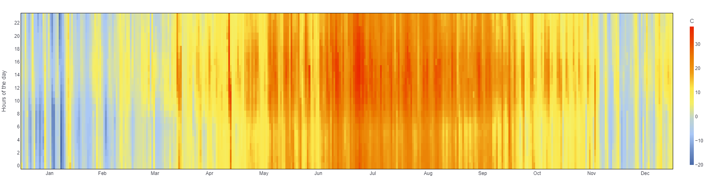

# Add a chart to your Pollination app

Install the following libraries first

```
pip install ladybug-charts streamlit
```

Start by importing the libraries

```python
import streamlit as st
from ladybug.epw import EPW
```

Set the title of the page and layout

```python
st.set_page_config(
    page_title='Dry bulb temperature', layout='wide'
)
```

Create an EPW object from an epw file and create a Plotly figure from the dry bulb
temperature.

```python
epw = EPW("file path to epw file")
figure = epw.dry_bulb_temperature.heat_map()
```

Finally, add the title to the page and visualize dry bulb temperature as a Plotly chart.

```python
st.title("Dry bulb temperature")
st.plotly_chart(figure, use_container_width=True)
```

You should see an annual heatmap appear in the streamlit app.

