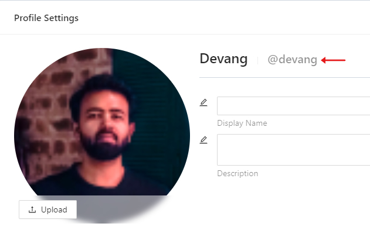
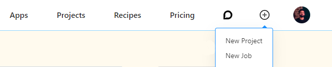
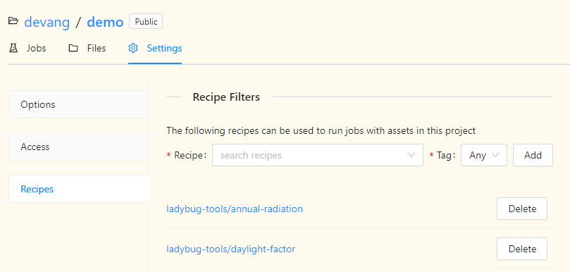

# Create a Job

A Job on Pollination can be created using the API client, owner name, project name, and
recipe inputs.

### API Client

A Pollination API client can be created using a Pollination API key. A user of your app
can find a Pollination API key in the "Developer Settings" section
under the "Settings" tab of their profile on Pollination. If they don't have a key,
they can generate one by entering any name for the key and clicking on the "+" button.
Once they have this key, they can copy it to the clipboard and paste it back to the
Pollination-app.


### Owner Name

The owner name is the username of the user who is scheduling this job on Pollination.
This username too can be found in the "Profile Settings" section of the "Settings"
tab on Pollination. The username is typically followed by a "@" on the "Profile Settings".



### Project Name

The project name is name of the project the scheduled job will go into. A user can create
a project on Pollination by clicking on the "+" button on the navigation bar at the top.
If a project already exists, the user can use that project's name.



### Recipe Inputs

Visit any [recipe](https://app.pollination.cloud/recipes) on Pollination to find out
the inputs for the recipe

> **_Note:_** The recipe needs to be added to the project before it can be used. A recipe can be
> added to the project by going to the 'Recipes' on the 'Settings' tab of the project.



We will create a job on Pollination to run the
[daylight-factor](https://app.pollination.cloud/ladybug-tools/recipes/daylight-factor)
recipe on the gridbased model that ships with Ladybug Tools.

Install the following libraries first

```python
pip install streamlit pollination-streamlit
```

Importing necessary libraries

```python
import streamlit as st
from pathlib import Path
from pollination_streamlit.api.client import ApiClient
from pollination_streamlit.interactors import NewJob, Recipe
```

Helper function to create a job

> **_Note:_** The last four arguments are recipe specific inputs.

```python
def create_job(
        api_client: ApiClient,
        owner: str,
        project: str,
        name: str,
        description: str,
        cpu_count: int,
        grid_filter: str,
        min_sensor_count: int,
        hbjson: Path,
        radiance_parameters: str) -> str:
    """Create a job to run the daylight-factor recipe on Pollination.

    args:
        api_client: An ApiClient object.
        owner: The owner of the Pollination account.
        project: The name of the project inside which this job will be created.
        name: The name of the job.
        description: A description of the job.
        cpu_count: The number of CPUs to use for the job.
        grid_filter: A regex pattern as a string to filter grids.
        min_sensor_count: The minimum number of sensors to use per CPU.
        hbjson: The path to the HBJSON file.
        radiance_parameters: A string of radiance parameters.

    returns:
        The id of the created job.
    """

    recipe = Recipe('ladybug-tools', 'daylight-factor',
                    'latest', api_client)

    new_job = NewJob(owner, project, recipe, name=name,
                     description=description, client=api_client)
    arguments = {}

    model = new_job.upload_artifact(hbjson, '.')

    arguments['cpu-count'] = cpu_count
    arguments['grid-filter'] = grid_filter
    arguments['min-sensor-count'] = min_sensor_count
    arguments['model'] = model
    arguments['radiance-parameters'] = radiance_parameters

    new_job.arguments = [arguments]

    job = new_job.create()

    return job.id
```

Create a streamlit form to collect inputs from the user and submit the job

```python
with st.form('daylight-factor-job'):
    api_key = st.text_input(
        'Enter Pollination API key', type='password')
    owner = st.text_input('Project Owner')
    project = st.text_input('Project Name')

    st.markdown('---')

    cpu_count = st.number_input('CPU Count', value=50)
    grid_filter = st.text_input('Grid Filter', value='*')
    min_sensor_count = st.number_input('Min Sensor Count', value=200)
    hbjson_data = st.file_uploader('Upload HBJSON')
    rad_parameters = st.text_input('Rad Parameters',
                                   value='-ab 2 -aa 0.1 -ad 2048 -ar 64')

    submit_button = st.form_submit_button(
        label='Submit')

    if submit_button:
        # create HBJSON file path
        hbjson_file = Path('.', 'model.hbjson')
        # write HBJSON file
        hbjson_file.write_bytes(hbjson_data.read())

        api_client = ApiClient(api_token=api_key)
        job_id = create_job(api_client, owner, project,
                            'test', 'Daylight-factor job for Pollination docs',
                            cpu_count, grid_filter, min_sensor_count, hbjson_file,
                            rad_parameters)

```

The above code will render the following streamlit form that can be used to submit a
job on Pollination to run the daylight-factor recipe.


A job submitted using this form can be accessed
[here](https://app.pollination.cloud/devang/projects/demo/jobs/aff2fd62-ea58-4bd5-957c-c00474fe0cd4).
