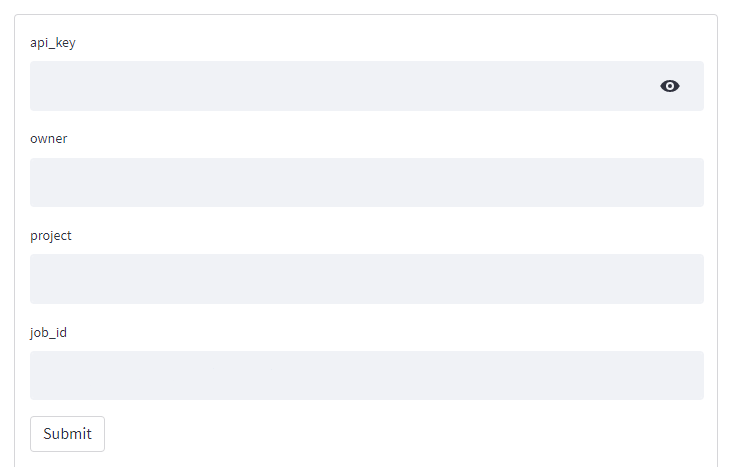
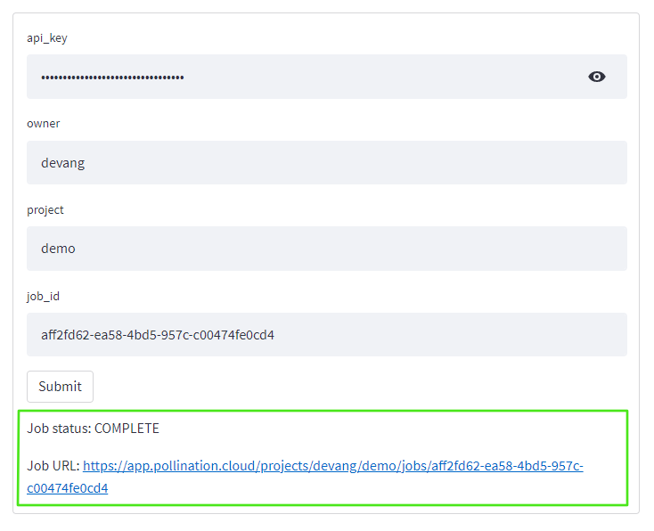

# Check the status of a Job on Pollination

On Pollination, a job's status can be checked by using the job's id, owner name,
project name, and the API client. You get a job's id once the job is created and submitted
to Pollination. Check [here](create-job.md) to learn how to create and submit a job.

Install the following libraries first

```python
pip install streamlit queenbee pollination-streamlit
```

Import necessary libraries

```python
import streamlit as st
from enum import Enum
from typing import Tuple
from queenbee.job.job import JobStatusEnum
from pollination_streamlit.interactors import Job
from pollination_streamlit.api.client import ApiClient
```

Helper function to get job status

```python
class SimStatus(Enum):
    NOTSTARTED = 0
    INCOPLETE = 1
    COMPLETE = 2
    FAILED = 3
    CANCELLED = 4


def get_job_status(owner: str, project: str, job_id: str,
                   api_client: ApiClient) -> Tuple[SimStatus, str]:
    """Get the status of a job from Pollination.

    args:
        owner: The owner of the Pollination account.
        project: The name of the project inside which the job was created.
        job_id: The id of the job.
        api_client: An ApiClient object.

    returns:
        A tuple of two items:

        -   The status of the job.

        -   URL of the job on Pollination.
    """

    job = Job(owner,
              project,
              job_id,
              client=api_client)

    url = f'https://app.pollination.cloud/projects/{owner}/{project}/jobs/{job_id}'

    if job.status.status in [
            JobStatusEnum.pre_processing,
            JobStatusEnum.running,
            JobStatusEnum.created,
            JobStatusEnum.unknown]:
        return SimStatus.INCOPLETE, url

    elif job.status.status == JobStatusEnum.failed:
        return SimStatus.FAILED, url

    elif job.status.status == JobStatusEnum.cancelled:
        return SimStatus.CANCELLED, url

    else:
        return SimStatus.COMPLETE, url
```

Streamlit form to query job status

```python
with st.form('job-status'):
    api_key = st.text_input('api_key', type='password')
    owner = st.text_input('owner')
    project = st.text_input('project')
    job_id = st.text_input('job_id')

    submit_button = st.form_submit_button(
        label='Submit')

    if submit_button:
        status, url = get_job_status(owner, project, job_id,
                                     ApiClient(api_token=api_key))
        st.write(f'Job status: {status.name}')
        st.markdown(f'Job URL: {url}')

```

The Streamlit form above will render the following interface;



Providing API key, owner, project and job_id in the form above will serve the following
result;


