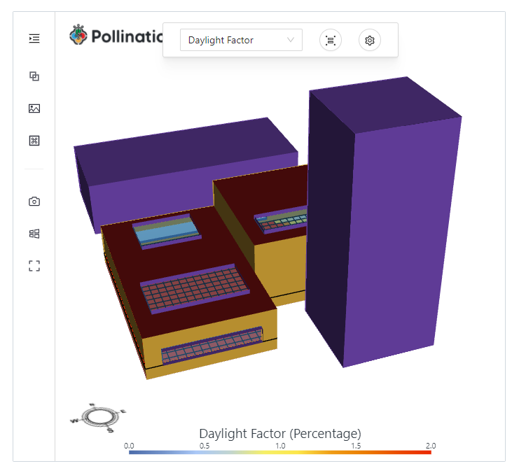

# Visualize a model with the data in the web app

In [this](https://docs.pollination.cloud/user-manual/pollination-apps/download-output) section we downloaded the "visualization" output of the daylight-factor
study that we ran, which downloaded a file named "daylight_factor.vtkjs". We will now visualize that file in the Pollination web app.

Install the following libraries first

```python
pip install streamlit-vtkjs
```

Visualize the vtkjs file in the web app

```python
from streamlit_vtkjs import st_vtkjs
from pathlib import Path

vtkjs_path = Path('daylight_factor.vtkjs')
st_vtkjs(content=vtkjs_path.read_bytes(), key='df')
```

This should render the model inside the Pollination viewer in the web app;


In order to learn more about the viewer, read this [section](https://docs.pollination.cloud/user-manual/pollination-apps/integrating-the-pollination-viewer)
