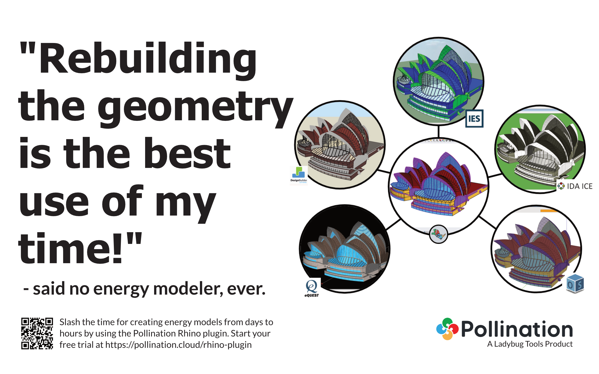
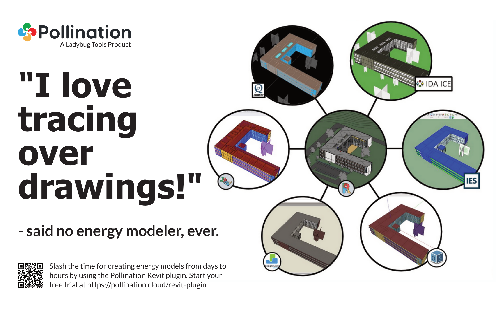
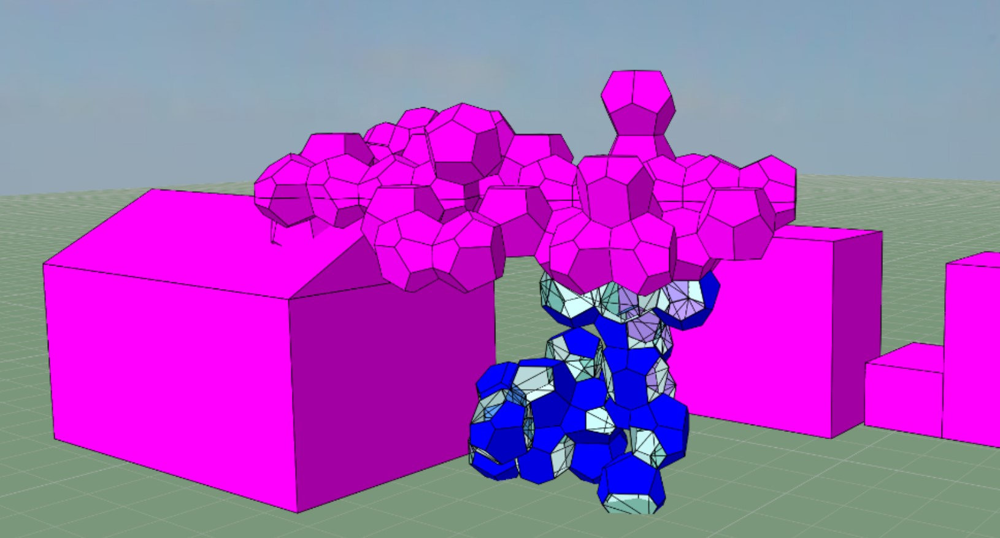
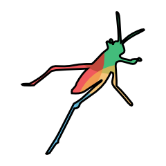
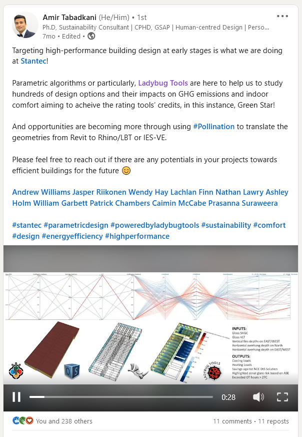

# User Manual

## Welcome to the Pollination User Manual!

This manual includes what you will need to use different Pollination products.

 Pollination is a fully integrated suite of building performance simulation products to address the inefficiencies in the building performance simulation process and support industry professionals' goal of speeding up the feedback loop while maintaining their quality of work have helped hundreds of customers use pollination.

Among other products, Pollination has developed plugins for Revit and Rhino to address the first and one of the most challenging steps of the process: preparing a valid energy simulation model, we have come a long way in the process. Our customers from all around the world have been using PollinationRevit and  Rhino plugins to get from an architectural model in Revit or Rhino to a valid simulation model in a fraction of the time and focus on the more enjoyable steps of the process that need their professional expertise. "None of us went to school hoping to spend most of our time tracing over plan drawings!"

<figure><figcaption>
Said no energy modeler, ever!
</figcaption></figure>

We know what you might be thinking. "_This sounds good but_ _have you seen the models that we get from architects?_" - Yes. We have! And we have helped hundreds of customers to use Pollination with those real-world models.  We can help you to do the same.

<figure><figcaption></figcaption></figure>

## Pollination Revit Plugin

Let's start with the Revit plugin, and answer one of the most common questions. What makes Pollination Revit plugins different? i.e. why should you spend your time trying "yet another BEM plugin for Revit" when all the other ones that you have tried didn't work?

What makes the Pollination Revit plugin different is its practical approach to solving the problem. We neither sugarcoat the state of the industry nor pretend that we have found the magic bullet that fixes all the problems with your Revit models. Instead, we have developed a practical product that helps you get a valid model from the real-world imperfect Revit models.

### **The 3 facts about Revit models for energy modelers**

Here are the 3 facts about Revit models for energy modelers:

1. You will never ever ever receive a Revit model from an Architect ready to be exported as an energy model. Just get over it!
2. Revit models are prepared for a different purpose than energy modeling. Mostly, documentation. This will not change because you don't like it.
3. Even though Revit models are imperfect and messy, they are full of useful information. That's why the last model that you built was traced over a PDF generated from Revit!

Knowing these facts, we have developed the plugin not to _try to be smart_ but to help you save a significant amount of time with a minimum but necessary user interaction.&#x20;

<figure><figcaption>
Save a significant amount of time
</figcaption></figure>

### Why should you try yet another building energy modeling Revit plugin?

In short, because it works, and it saves you a significant amount of time! If it doesn't we will give your money back.

To ensure we can deliver reliable workflows:

* We have rewritten all the extraction methods from scratch and tested them against hundreds of models.
* We have also developed an automated validation routine that detects any possible issues in your model.
* We have developed a [Model Editor](broken-reference) with [automated workflows](model-editor/workflows.md) to fix those issues in your model.
* We have written direct export from our schema to other building energy simulation tools using their native file formats such as .GEM for IES VE, .INP for eQuest, .OSM for OpenStudio, .IDF for EnergyPlus, and .IDM for IDA-ICE. We still rely on .gbXML for some of the simulation tools such as DesignBuilder and TRACE 3D Plus but we are closely working with both of them to ensure the models are imported to their platforms reliably.

<figure><figcaption>
Said no energy modeler, ever!
</figcaption></figure>

That's why we are confident that any valid Pollination model will be exported to any of the supported building performance simulation tools with no issues. If you find an issue in the process that we cannot fix, we will give you all your money back! The days of getting exploded gbXML models from Revit are over! Those were before the Pollination Revit plugin.

<figure><figcaption>
An analytical model exported from the exact same Revit model with and without using Pollination. Pollination provides a useful starting point even with no model clean up.
</figcaption></figure>

### What is the process of exporting the model?

The exporting process consists of two steps:

#### 1. Creating a Pollination model from the Revit model

The first step of the process is to use the Pollination plugin to review the Revit model and insert any missing rooms, spaces, or areas. Then select the Revit families that should be exported as windows and doors, and create a snapshot. At this step, you don't have to worry about the misalignments or the small overlaps between the rooms. That's for the next step.

#### 2. Cleaning up the model inside the Model Editor

Once you have the snapshot you are ready to clean it up in the Model Editor. After fixing hundreds of real-world Revit models we have developed[ a dozen commands](model-editor/commands.md) to automatically fix the [common geometry issues in energy models](model-editor/workflows.md).

Here is a video that walks you through the whole process in less than 30 minutes. See [this page](revit-plugin/export-analytical-model/) for more in-depth tutorials.



Once you are done with the cleaning up you can [export the model to any of the supported file formats](model-editor/supported-file-formats/export.md).

### But does it work for our models?

We understand that trying yet another building energy modeling plugin for Revit is high risk. As much as you need a better workflow, you don't want to look bad because you recommended a plugin that doesn't work. To make it even easier to get started we will help you with exporting your first Revit model at no cost and before you commit to buying the Revit plugin. If anything goes wrong it will be on us, and if it works you will look like the smartest person in the office!

<figure><figcaption>
We got your back!
</figcaption></figure>

## Rhino Plugin

We know not everyone is lucky to have access to a Revit Model. You might get only 2D CAD drawings, or 3D models in Rhino or SketchUp. In those cases, you should use the Pollination Rhino plugin. The combination of Rhino's robust geometry library and Pollination's commands for setting up and fixing models has made the Rhino plugin "the best tool for generating building performance geometry" in the market.&#x20;

<figure><figcaption></figcaption></figure>

### What are the unique aspects of the Pollination Rhino plugin?

The main advantage of using the Rhino plugin is that you can slash the time that is spent on creating the model in comparison to the standard energy modeling tools so it doesn't block all the main simulation workflows that rely on a valid simulation model. The larger the project, and the more complex the geometry the more the benefit of using the Rhin oplugin. Here are a few examples of models with complex geometry built using the Pollination Rhino plugin.

<figure><figcaption>
Credits: Cloud City by Thornton Tomasetti and Studio Tomás Saraceno
</figcaption></figure>

<figure><figcaption>
Credits: <a href="https://vripack.com/project-zero/">https://vripack.com/project-zero/ </a>
</figcaption></figure>

The combination of the [validation routine](get-started/troubleshooting/rhino-plugin-errors/help-with-modeling-error-codes.md) and the [commands to find and fix the possible issues](rhino-plugin/pollination-commands/by-use-case.md) in the model slashes the time for getting from zero to a valid reliable model.

Similar to the Revit plugin, you can export a Pollination Rhino model to other building energy simulation tools using their native file formats such as .GEM for IES VE, .INP for eQuest, .OSM for OpenStudio, .IDF for EnergyPlus, and .IDM for IDA-ICE. We still rely on .gbXML for some of the simulation tools such as DesignBuilder and TRACE 3D Plus but we are closely working with both of them to ensure the models are imported to their platforms reliably.

<figure><figcaption>
Unparalleled Interoperability
</figcaption></figure>

In addition,  you can also import OSM, IDF, and GEM files to the Rhino plugin which introduces new opportunities for re-using the same model across different simulation tools.



Moreover, its combination with the Pollination Grasshopper Plugin allows you to reuse the Pollination Rhino models as input for your favorite Grasshopper and Ladybug Tools workflows. Here is an example of using the Pollination Rhino in combination with Ladybug Tools plugins to move quickly from a Revit model to being able to run hundreds of parametric studies.

<figure><figcaption></figcaption></figure>

## Other products

If you are using any of our CAD plugins or using EnergyPluss, OpenStudio, or Radiance Pollination offers a reliable  Cloud Simulation for running large parametric studies with tens of ready-to-use simulation recipes. We also offer Pollination Apps for developers to develop custom solutions on top of the Pollination product in a fraction of the time.

## Pricing

Unlink other companies, our pricing [is on our website](https://www.pollination.cloud/pricing#cad-plugins). Both Rhino and Revit plugins come with a 14-day free trial. We also offer a monthly subscription for all of our products. This makes it easy to get started with a minimum investment.



### What would be a good starting package?

The answer depends on the number of people who want to use the Pollination products. Most offices start with monthly subscriptions for 10 organization seats and a single bundled Revit and Rhino license.

See [this page](get-started/setting-up-rhino-grasshopper-and-revit-plugins/seats-vs-licenses.md) for the difference between seats and licenses and [this page](web-platform/account-setup/) for setting up your organization.

## Getting in touch

We will always be happy to hear from others who are interested in adopting more efficient workflows. You can always post your questions on [Pollination Discourse](https://discourse.pollination.cloud/) or email our co-founder directly at mostapha \[at] ladybug.tools


As you use this manual to navigate Pollination, you may notice some incomplete sections or screenshots don't look 100% the same on your computer. Since we are still testing and improving our platform things are changing rapidly. We'll try our best to update changes as we make them!


**Get started today by creating a** [**Pollination account**](https://app.pollination.cloud/)**!**
