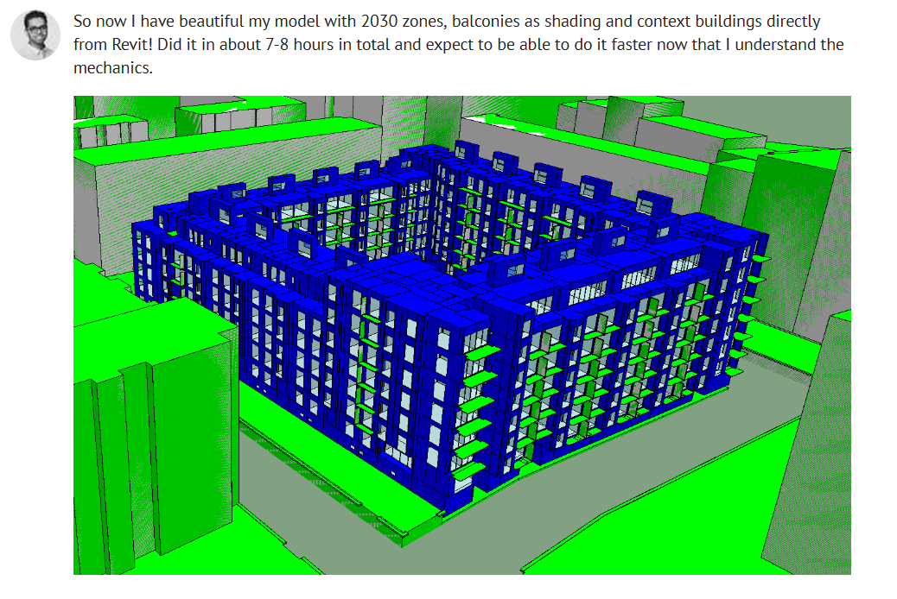
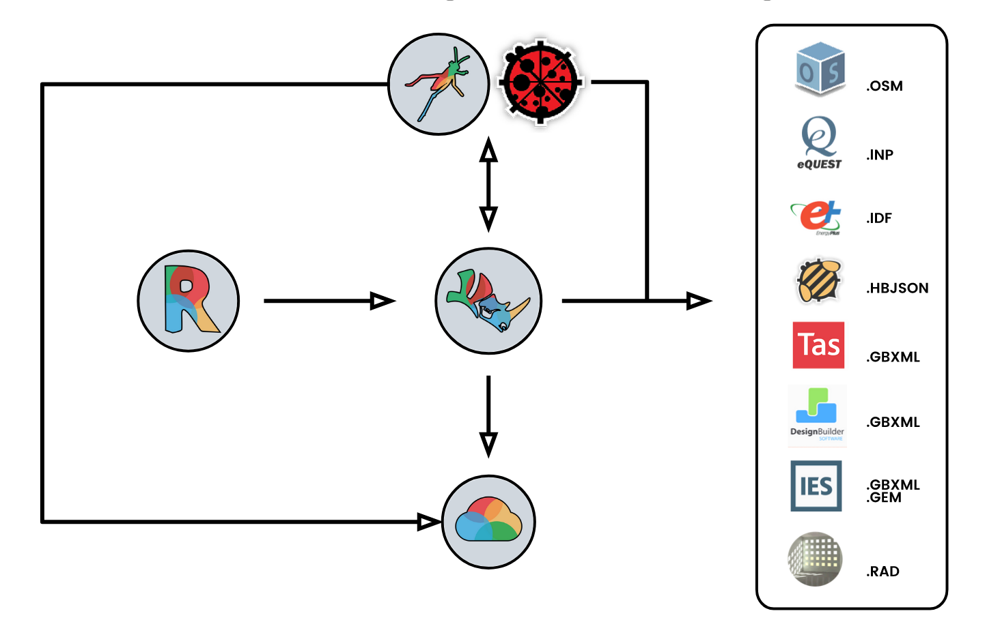

# User Manual

## Welcome to the Pollination User Manual!

If you're new to the Pollination ecosystem, this page will give you a quick overview of all that Pollination has to offer! Designed as a flexible, collaborative, and customizable system of tools, you can curate your interactions with Pollination to obtain actionable simulation data at the speed and level of detail you desire.


As you use this manual to navigate Pollination, you may notice some sections are incomplete or screenshots don't look 100% the same on your computer. Since we are still testing and improving our platform things are changing rapidly. We'll try our best to update changes as we make them!


At a very high level, the ecosystem is comprised of five components that are designed to work together in multiple user-defined configurations:

## CAD/BIM Plugins

You can use our plugins to connect your favorite CAD/BIM software to all that Pollination has to offer. Each plugin will allow you to set up and execute simulations and visualize results without ever leaving your software. You can use Pollination Cloud Computing resources, or you can choose to run simulations locally on your computer. We currently support plugins for the following software packages:

### **[Revit Plugin](https://www.pollination.cloud/revit-plugin)**

The Revit plugin is the best plugin in the market to extract clean analytical models from your Revit models. It automates what can be automated and it allows you to control the rest. If you want to get a quick overview of the Revit plugin functionalities watch the opening of the Masterclass that we taught at the AEC Tech workshop 2022.

Pollination Revit Masterclass

Even though you can set up and run the simulations from inside the Revit plugin it is currently mostly used for extracting clean analytical models that are exported to the Rhino plugin or other 3rd party applications for running the simulations. This diagram shows a few different ways in which you can use the Revit plugin.

Our current efforts are focused on two main areas:

1. Improving the routines and workflows for extracting the analytical model from Revit.
2. Improving the workflows for submitting the simulations and visualizing the results from/inside Revit. This includes both [recipes](#recipes) and [apps](#apps).

Here is the short list of the development tasks to achieve these goals:

- **Develop more forgiving solutions for exporting models**: we are working on a new method to use Revit `area plans` for extracting the model. This option will remove the need for placing every single room and space in the model. This feature will be available in early 2023.

- **Improve the solve adjacency routines**: if we want to recommend the Revit plugin for detailed energy modeling we have to ensure that our solve adjacency routines are reliable. Our current plan is to use our core libraries for solving the adjacency between the faces instead of using Revit routines.

- **Improve automated repairing routines**: we have started introducing a few fixing routines to the Revit plugin but they have a few limitations. One of the most important ones is that they only work in extruded mode. We have plans to expand these features to also be available in the detailed geometry routine.

- **Streamline the process to run the simulations and visualize the results**: we are working to unify the user experience for running the studies and visualizing the results by using the Pollination panel. We have already started the development, and the new workflow should be available for testing early 2023.

See [the testimonials on our website](https://www.pollination.cloud/revit-plugin#testimonials) to see what others think of the Revit plugin.

### **[Rhino Plugin](https://www.pollination.cloud/rhino-plugin)**

The Rhino plugin is the most flexible interface and "[the best tool for generating building performance analysis geometry](https://www.pollination.cloud/rhino-plugin#testimonials)". It cuts the time for preparing a model by taking advantage of Rhino's reliable and fast geometry library and adding [several new commands](./rhino-plugin/pollination-commands/README.md) to Rhino that automates creating, validating and fixing analytical models. If you want to get a quick overview of the Rhino plugin functionalities watch the opening of the Masterclass that we taught at the AEC Tech workshop 2022.

Pollination Rhino Masterclass

Here is another shorter video that shows how you can use the plugin to trace over 2D plans in Rhino.

Create analytical models in Rhino

An finally, this video shows how to quickly fix the models that are exported from Revit in a fraction of a time.

Fix analytical models in Rhino

One of the most loved features of the Rhino plugin is the ability to import and export models from different file formats. The export to IES using the GEM file format, and the seamless integration with Ladybug Tools Grasshopper plugins are two of the most loved features of the Rhino plugin.

<figure>
  
  <figcaption>
    
Pollination in combination with Ladybug Tools.

    
Source: https://www.linkedin.com/posts/amirtabadkani_stantec-parametricdesign-poweredbyladybugtools-activity-6947825739287130112-xRtN/

  </figcaption>
</figure>

Here is the short list of what we will be working on in relation to the Rhino plugin in 2023:

- **Add new repairing routines, and improve the existing ones**: we have already developed tens of routines to find the issues in a model and fix them. We are now starting to combine these commands into routines that can be used for repairing models quickly. [The workflow for fixing the misalignments in a model is an example of what we will be working on](https://discourse.pollination.cloud/t/introducing-po-genaligngrids-and-an-improved-po-aligntogrids-for-fixing-alignement-issues/2225).

- **Improve interoperability with other simulation tools**: we already support exporting to a handful of simulation tools. We are considering the development of a native export to [IDA-ICE](https://www.equa.se/en/ida-ice), and also improving the export routine to [eQuest](https://www.doe2.com/equest/) to support a larger range of geometry.

- **Improve interoperability with Ladybug Tools Grasshopper plugins**: we are working to improve the routines for bringing the updated models or simulation results that are generated using the Ladybug Tools plugin to Rhino. You should be able to replace your current model with an updated model in Grasshopper or bake the results of the study as a smart results grid in Rhino.

- **Streamline the process to run the simulations and visualize the results**: we are working to unify the user experience for running the studies and visualizing the results by using the Pollination panel. We have already started the development, and the new workflow should be available for testing early next year.

- **Provide better solutions to create and share custom standards**: we will develop a streamlined way to manage a custom standards library of constructions, schedules, programs, modifiers, etc. We had several requests for easy ways to build and manage their own office standards library with the Rhino plugin and share them using the Pollination Cloud organization.

- **Provide better solutions for detailed HVAC simulation**: There were several requests for adding support for detailed HVAC modeling to the Rhino plugin including [this conversation on Discourse](https://discourse.pollination.cloud/t/detailed-hvac-modelling-in-pollination/1987/11). We have already started the development for integrating Ironbug into Pollination workflows. We should be able to include the features in the public release before the end of the first quarter.

See [the testimonials on our website](https://www.pollination.cloud/rhino-plugin#testimonials) to see what others think of the Rhino plugin.

### **[Grasshopper Plugin](https://www.pollination.cloud/grasshopper-plugin)**

The Grasshopper plugin brings the power of Pollination cloud computing to Grasshopper. You can set-up and run simulations on Pollination without leaving the Grasshopper interface. It has never been this fast to prepare and run thousands of simulations.

## **[Cloud Computing](https://www.pollination.cloud/cloud)

Pollination cloud computing brings the power of high performance cloud computing at your fingerprints. We have helped several companies run tens or thousands of simulations on Pollination in a fraction of time that it would have taken them to run them locally. See [these testimonials](https://www.pollination.cloud/cloud#testimonials) as an example. One of the major advantages of Pollination's cloud computing is that it comes with [validated recipes](#recipes) for most of the common simulation workflows.

Here is the short list of the topics related to Pollination cloud computing for 2023:

- **Optimize the execution of running short-lived steps and small models**: the original design of Pollination for submitting several long-running simulations. What we saw instead were several studies with thousands of shoebox models for parametric studies. We have started optimizing our workflows to improve the run time for small models. They will be available in early 2023.

- **Implement better queueing for large parametric studies**: even though the cloud computing resources are almost infinite the resources that are available for each account on Pollination are not! We have seen users submitting thousands of simulations when an account has 50 CPUs and then being unimpressed with the results. We have plans to make the user experience closer to what one would expect by queueing the submission of the simulations so the ones that are submitted first will be finished first.

- **Provide simple solutions for customizing existing recipes**: Pollination recipes are customizable but the process of customizing a recipe is not easy. From what we have seen most of the customization that people ask for is for additional postprocessing steps. We have plans to provide easier ways for users to add those steps to the existing recipes.

## **[Recipes](https://app.pollination.cloud/recipes)**

Pollination simulation recipes are a collection of reusable and customizable simulation workflows. Pollination comes with a set of recipes for common energy, daylighting, and comfort simulations that meet the requirements of several green building standards and codes. You can also build your own recipes or edit the Pollination recipes based on your needs. All the recipes are accessible from all our CAD plugins and the [web platform](#web-platform).

See the full list of available recipes [here](https://app.pollination.cloud/recipes).

## [Web Platform](https://www.pollination.cloud/platform)

The web platform is the heart of the system. Your first interaction with Pollination will likely be the web platform because you'll use it to create a FREE Pollination account. Additionally, the web platform gives you access to the following features:

- Cloud computing resources
- Tool-agnostic, web-based simulation setup, execution, and result visualization
- Unrestricted access to simulation data
- Organization resources such as projects, studies and recipes
- Organization members and teams

## [Apps](https://www.pollination.cloud/apps)

Our app gallery is guaranteed to be your favorite feature of our platform! You can use apps provided by us or [create your own apps](./apps/introduction.md) that use Pollination under the hood. Create custom reports (think LEED daylighting or energy!), bring in context geometry from your favorite GIS platform, etc. The possibilities are endless! Here is a video that shows how apps work from inside Revit and Rhino.

Pollination Apps Preview

Apps are still in beta which makes them different from all the other Pollination products. We spent the 2022 building the infrastructure for building, deploying, and running an app. We also worked on building a robust integration between the apps and the CAD plugins. Finally, we taught two in-person workshops to get a better sense of the level of expertise in the industry, and what should be considered for a successful larger adoption of the industry.

We have made major progress in all directions but we still have work to do for getting all the pieces to work together smoothly. Our goal is to officially release the apps at some point in 2023.

Here is the short list of the topics that we will be working on in 2023:

- **Improve pollination <> Streamlit libraries**: we have developed a few libraries to transform a Streamlit app into a Pollination app. We will be working on improving these libraries to make the process as smooth and as easy as possible. The most important libraries are: `pollination-streamlit`, `pollination-streamlit-io`, and `pollination-viewer`.

- **Establish development best practices**: we need to establish the best practices for developing Pollination apps as we are developing more examples. By using these best practices in our sample apps it will be easy for others to develop their own apps quickly.

- **Improve the start-up time**: we will work on finding a cost-effective solution to improve the start-up time for the apps. There are several available options including the option of using users' desktop resources for running the apps from inside the CAD plugins.



We understand that Pollination as an ecosystem is different from most of the tools that you have tried before, and you might have more questions. Feel free to start a topic on [Pollination Discourse](https://discourse.pollination.cloud/) or reach out to us via email with your questions.



**Get started today by creating a** [**Pollination account**](https://app.pollination.cloud/)**!**
