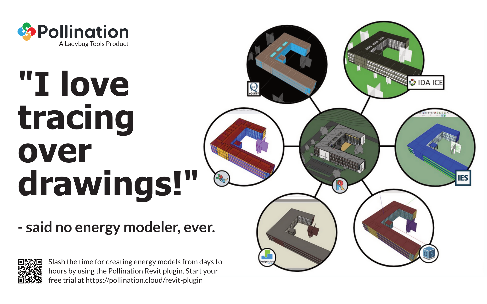
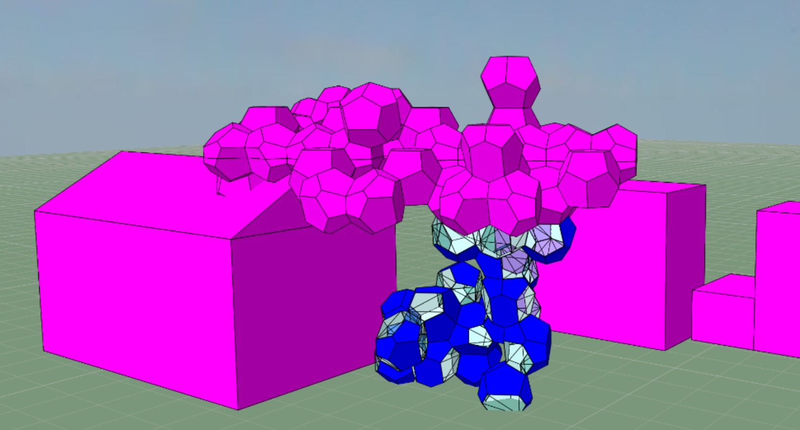
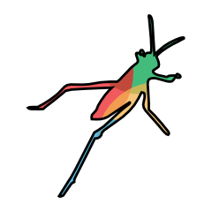
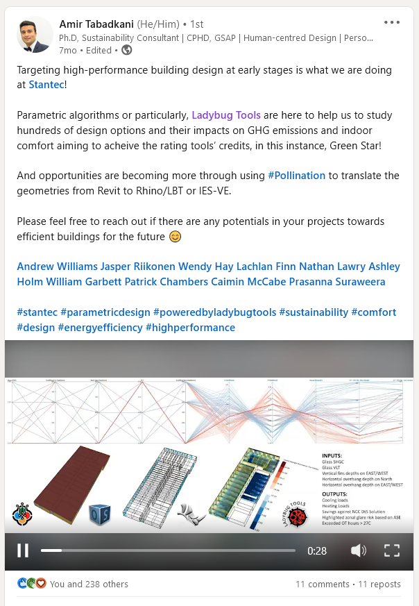

# Pollination User Manual

## Welcome to the Pollination User Manual!

This manual includes what you will need to understand, buy and use the Pollination products.

<figure><figcaption></figcaption></figure>

## What is Pollination?

If you landed here from a search not knowing what Pollination is you should probably visit [our website](https://pollination.solutions/) but here is also a quick summary.

 Pollination exists to address the pain point of preparing the energy models based on architectural design models. Without Pollination, most practitioners creating their models by tracing over 2D drawing. What a \[...] waste of time and talent!

Pollination Revit plugin and Pollination Revit and Grasshopper plugins streamline the transition of building models from Revit and Rhino to building energy simulation software so you don't have to trace over the drawings anymore. It is easier, faster and it gives you a better model.

<figure><figcaption></figcaption></figure>

We understand that everyone has their own preferred energy simulation software, as it is a very fragmented market. That is why we support a growing list of the most frequently used building simulation software, including but not limited to EnergyPlus, eQuest, OpenStudio, IESVE, DesignBuilder, IDA ICE, Ladybug Tools Honeybee, and Pollination Rhino.

Unlike other interoperability tools, we don't rely on gbXML. For all the software mentioned above, we export the model to their native file format. For instance, we generate an IDF file for EnergyPlus, an INP file for eQuest, and a GEM file for IESVE. That's how we can guarantee the quality of the export and a successful import to your software of choice. That said, Pollination also exports a valid gbXML file that you can use to export your model to software like TRACE700, TRACE 3D Plus, HAP 6.3+, EnergyPro, and more.

<figure><figcaption></figcaption></figure>

We understand the desire for an exact percentage or a specific number of hours that Pollination will save you. However, we can't provide that without making up some numbers. The truth is that the time saved varies between models, but here's what we've observed among customers using Pollination:

* For models that previously took 1-2 days to build without Pollination, the time is reduced to a couple of hours with Pollination.
* For models that used to take a week or more, the time can be reduced to a couple of days.

Once you learn how to use Pollination, you can say goodbye to drawing models from scratch..

<figure><figcaption></figcaption></figure>

If you are still skeptical, [check out what our customers are saying about Pollination](https://www.pollination.solutions/customers). More likely than not, you'll recognize some of the faces, and you can get in touch with them to ask about Pollination and how it has helped them with their projects.

## We guarantee the quality of the Pollination exported models

Before moving to the next part to explain how the plugins work, it's helpful to mention that [we have a pact with our customers](https://www.pollination.solutions/pact) to export every valid Pollination model to Pollination-supported file formats without errors. If we can't fix it, you'll receive a full refund.



## We support you for getting started with your real world projects

We understand that trying yet another building energy modeling plugin can be risky. While you need a better workflow, you don't want to look bad by recommending a plugin that doesn't work. To make it easier to get started, we will help you export your first Revit and Rhino models at no cost, even before you commit to buying the plugins. If anything goes wrong, it will be on us, and if it works, you'll look like the smartest person in the office!

<figure><figcaption></figcaption></figure>

## Pollination Revit Plugin

<figure><figcaption></figcaption></figure>

We know, particularly when it comes to a Revit plugins to export energy models, everyone is extremely skeptical. We know what you might be thinking. "_This sounds good but_ _have you seen the models that we get from architects?_" - Yes. We have! And we have helped hundreds of customers to use Pollination with those real-world models. We can help you to do the same.

Here is our secret sauce: instead of trying to develop a magic one-click software that claims to fix everything but disappoints when used in real-world projects, we have built a software that helps automate most of the process while relying on your intelligence to ensure the quality of the outcome, especially when dealing with real-world, imperfect Revit models.

<figure><figcaption>
<a href="https://www.pollination.solutions/revit-plugin#facts">https://www.pollination.solutions/revit-plugin#facts</a>
</figcaption></figure>

We expect you to put in some minimum effort, and in return, we will save you hours and days of time. If you're looking for a single-click magical button to give you a cleaned-up model, Pollination is not for you.

<figure><figcaption></figcaption></figure>

Here is a 15-minute video that walks you through the process using the current version of the Revit plugin.



In the next couple of months, we will release a new version of the Revit plugin with a much better user interface and a streamlined workflow. Here is a demo of the upcoming version of the Revit plugin.



If you enjoy detailed step-by-step tutorials, then you should check out the hands-on tutorials for the Revit plugin.


[hands-on-tutorial](revit-plugin/pollination-revit-classic/hands-on-tutorial/)


##  Pollination Rhino Plugin

<figure><figcaption>
Here is an example of a complex geometry that is translated using the Pollination Rhino Plugin. You model doesn't have to be this complex to use Pollination but if you get one, you know that there is a software that you can use to create the model without causing major damage to your brain.
</figcaption></figure>

Not everyone has access to a Revit Model. If you only have 2D CAD, PDF drawings, or 3D models, you can use the Pollination Rhino plugin to build your models.

This process technically involves redrawing the model, but it is much faster than using the native geometry modeling environment of the energy modeling software. The combination of Rhino's robust geometry library and [Pollination's commands](rhino-plugin/pollination-commands/by-use-case.md) for setting up and fixing models has made the Rhino plugin "the best tool for generating building performance geometry" in the market.

<figure><figcaption></figcaption></figure>

Here are two example of models that are built by the Pollination Rhino plugin for real world projects.

<figure><figcaption>
Credits: <a href="https://vripack.com/project-zero/">https://vripack.com/project-zero/ </a>
</figcaption></figure> <figure><figcaption>
Credits: Cloud City by Thornton Tomasetti and Studio Tomás Saraceno
</figcaption></figure>

See the [Rhino plugin section](https://app.gitbook.com/s/-MaZZSUE1L_iKrqfreV9/rhino-plugin) to get started with using the Rhino plugin.

### Integration with Grasshopper

If you are a Ladybug Tools user Pollination can save you from the complexity of building the energy model itself in Grasshopper. Pollination Grasshopper Plugin allows you to reuse the Pollination Rhino models as input for your favorite Grasshopper and Ladybug Tools workflows.


Ladybug Tools Grasshopper script before and after Pollination


Here is an example of using Pollination Rhino with Ladybug Tools plugins to quickly transition from a Revit model to running hundreds of parametric studies.

<figure><figcaption></figcaption></figure>

## Buying Pollination

Refer to [this section of the user manual](getting-started/buying-pollination-products/) for everything that you need to know about buying Pollination including Pollination licensing structure.

It might worth a mention that unlike many other software companies, our pricing [is on our website](https://www.pollination.solutions/pricing#cad-plugins). You don't have to contact us if you only would like to know the pricing.



## Getting in touch

We will always be happy to hear from individual and companies interested in adopting more efficient workflows. You can always post your questions on [Pollination Discourse](https://discourse.pollination.solutions/), contact us [from our website](https://www.pollination.solutions/contact), or email our co-founder directly at `mostapha [at] ladybug [dot] tools`.


As you use this manual to navigate Pollination, you may notice some incomplete sections or screenshots don't look 100% the same on your computer. Since we are still testing and improving our platform, things are changing rapidly. We'll try our best to update changes as we make them!

