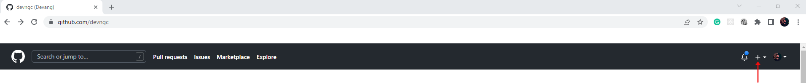

# Automate Deployment Using Github Actions

> **Warning** This section is for advanced users who are comfortable with with the Github Actions workflow.

Before going though this section, it is recommended to go through the [Deploying an App](deploying-app.md) section.

Create an account with Github and [create a new repository](https://docs.github.com/en/get-started/quickstart/create-a-repo). While creating the repository, we recommend that you use the same name for the repository name that you used for the app name. We will use the name "epw-wind" for this repository.

