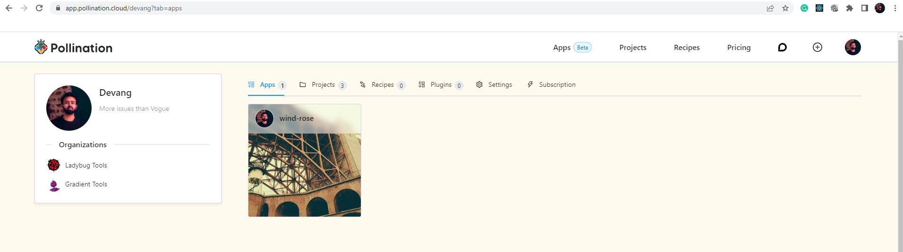
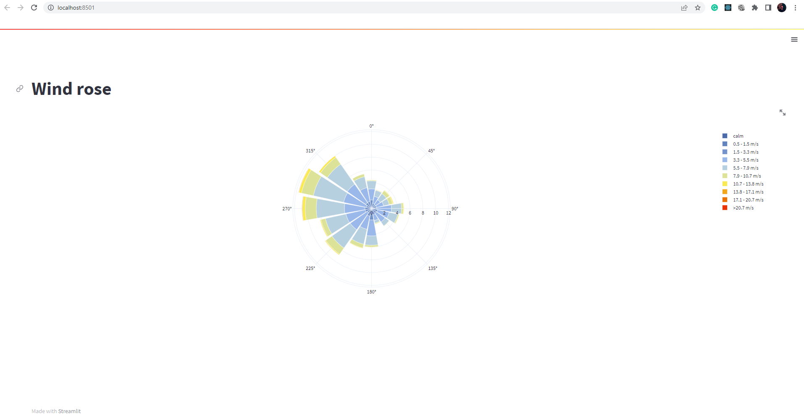
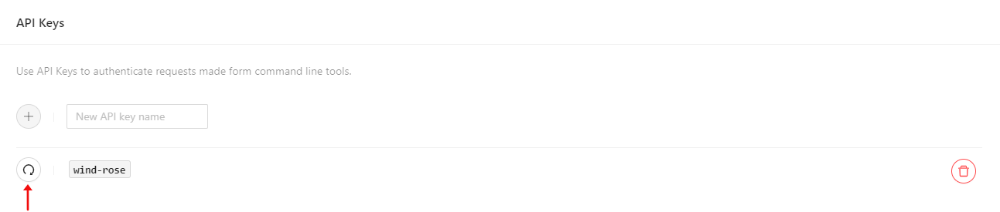
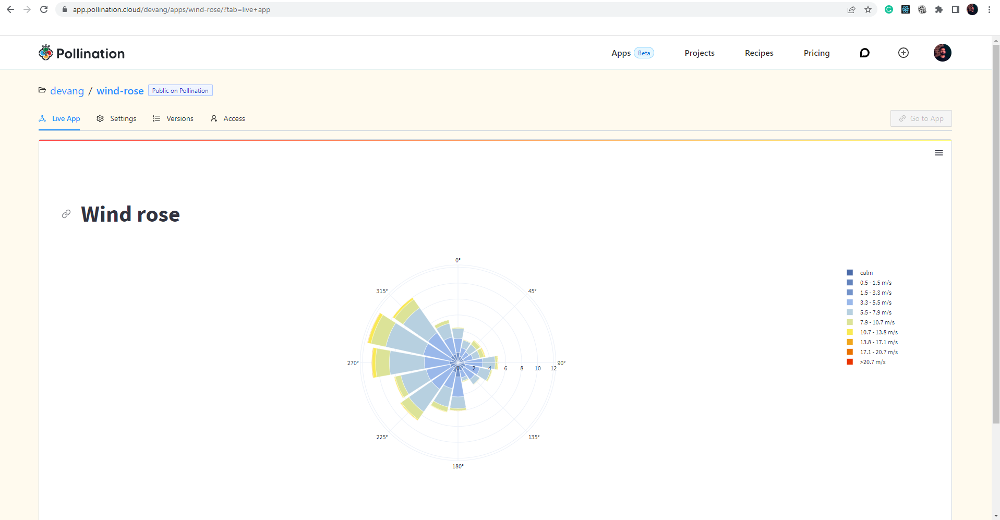

# Deploy an App

In this section, we will see how you can deploy your own app on Pollination Cloud. As an example to demonstrate the process, we will write and deploy an app that draws a wind rose using the EPW data. At the end of this section, you will have deployed an app named **wind-rose** that appears under the **Apps** tab on your profile.



### Prerequisite

In order to follow this section, you will need to be comfortable doing basic actions using the command line. The following are some basic tutorials for the command prompt on Windows and the terminal on Mac.

- [windows](https://youtu.be/A3nwRCV-bTU)
- [Mac](https://youtu.be/aKRYQsKR46I)

### Step-1: Creating a folder to write the app

We first need to prepare a folder in which we will write the app. This folder will be used later to deploy the app to Pollination Cloud. We will take the help of the [pollination-apps](https://pollination.github.io/pollination-apps/cli.html) library by the Ladybug Tools team to create this folder for us.

Install the `pollination-apps` library by using the following command on your command prompt / terminal.

```python
pip install -U pollination-apps
```

Go to the location on your system where you'd like to create the app folder and run the following command;

```python
pollination-apps new
```

This will ask for the project name. The project name here will become the name of your app. Also, make sure to not have any blank spaces in your project name. In our case, we will choose the project name to be **wind-rose**.

```
project_name [Python Boilerplate]: wind-rose
```

Next, it will ask for the project_slug. Enter the same name you entered above or keep it blank which will use the same name you entered above for the project_name. We are keeping it blank.

```
project_slug [wind-rose]:
```

Next, we will enter project_short_description. This is a short description of your app.

```
project_short_description [The best Pollination app... so far!]: Generate a wind rose from EPW.
```

Next, comes pollination_owner. This is your username in Pollination. We looked at how to find this owner name in [this](https://docs.pollination.cloud/user-manual/apps/create-job) section.

```
pollination_owner []: YOUR_USERNAME
```

Next, pollination-apps will ask you whether you'll need the [Pollination-viewer](integrating-the-pollination-viewer.md) in your app. You'll most likely need the Pollination viewer in your app if you are dealing with any 3D geometry. In this case, we're simply creating a 2D interactive chart so we will choose not to have the Pollination viewer.

```
Select pollination_viewer:
1 - no
2 - yes
Choose from 1, 2 [1]:1
```

Next, pollination-apps will give you an option to choose the visibility setting of the app you are deploying. We will choose the `public` option. We will choose our app to be public.

```
Select app_visibility:
1 - public
2 - private
Choose from 1, 2 [1]: 1
```

Lastly, pollination-apps will give you an option to whether create [github-actions](https://github.com/features/actions) for this app or not. We will choose yes and will look at using github-actions to deploy this app in the next section.

```
Select ci:
1 - github-actions
2 - none
Choose from 1, 2 [1]: 1
```

Doing this should give you a folder named wind-rose in your current working directory with the following file structure;

```
wind-rose
│   .gitignore
│   .releaserc.json
│   README.md
│
├───.github
│   └───workflows
│           ci.yaml
│
└───app
        app.py
        Dockerfile
        requirements.txt
```

### Step-2: Updating dependencies

The requirements.txt file inside the app folder contains a list of dependencies that your app needs to run. We will update the requirements.txt file to include the libraries we need to run the app. This list will mostly differ for each app based on the libraries we need to run the app. if you are unsure about the libraries you need in this file, go ahead and start writing your app. Once you have finished writing the app, make sure to come back and update the requirements.txt file to reflect all the necessary libraries.

In the requirements.txt file, we will make sure to have the latest version of the libraries we need to run the app. Let's make the content of the file as follows;

```
pollination-streamlit>=0.2.1
ladybug-charts>=1.18.3
```

These are the libraries we need to run the app. To find the latest version of any library that you may want to use with your app, please search for that library on the [pypi](https://pypi.org/search/?q=) website.

### Step-3: Installing libraries

Change directory and arrive at the **app** folder created inside the wind-rose folder at the end of step-1. Once app folder is your current working directory, run the following command. This will install all the dependencies in the requirements.txt file.

```python
pip install -r requirements.txt
```

### Step-4: Writing the app

Now that we have the folder in place. We can write the app. We will be using the app.py file created in the app folder to write the app. Let's clear the file and write the following to generate a wind rose using the EPW data.

```python
import streamlit as st
from ladybug.epw import EPW
from ladybug.windrose import WindRose


st.set_page_config(
    page_title='Wind rose', layout='wide'
)


epw = EPW("./assets/sample.epw")
wind_directions = epw.wind_direction
wind_speeds = epw.wind_speed


wind_rose = WindRose(wind_directions, wind_speeds)
figure = wind_rose.plot()

st.title("Wind rose")
st.plotly_chart(figure, use_container_width=True)

```

Please note that we created a subfolder called **assets** inside the app folder. This subfolder will contain the EPW data file we are using renamed as **sample.epw**. So after creating the assets folder, the structure of the wind-rose folder will look like the following;

```
wind-rose
│   .gitignore
│   .releaserc.json
│   README.md
│
├───.github
│   └───workflows
│           ci.yaml
│
└───app
    │   app.py
    │   Dockerfile
    │   requirements.txt
    │
    └───assets
            sample.epw
```

Once done, run the following command from inside the app folder;

```python
streamlit run app.py
```

This should render the following in the browser;



If the app runs as expected, enter `ctrl + c` on the command line to stop the app.

### Step-5: Running the app in a Docker container

Before, deploying the app, it is necessary to run the app in a Docker container. In order to run the app in a Docker container, we will need to install Docker desktop first. Visit this [link](https://www.docker.com/products/docker-desktop) to download the Docker desktop and install it on your system. Once installed, run the docker desktop and keep it running in the background.

Once the docker desktop is running, Let's go to the app folder and use the `run` command from the Pollination-apps library to run the app in a Docker container.

You can find out the structure of this command by using the following command;

```
pollination-apps run --help
```

This should show the following in the command line;

```
Usage: pollination-apps run [OPTIONS] PATH OWNER

  Build and run the application locally.

  Args:     path: Full path to apps folder.
  owner: The owner of the app on pollination. e.g. ladybug-tools

Options:
  -n, --name TEXT  the name of the app (defaults to folder name)
  -t, --tag TEXT   the tag for this version of the app
  --help           Show this message and exit.
```

Let's run the command now to run the app in a Docker container. The **.** here means that we want the current working directory to be the path.

```
pollination-apps run . YOUR_USERNAME
```

This will take a while depending on the size of the app and the number of dependencies in the requirements.txt file. If everything works fine you should see the following appear in the command line;

```
  You can now view your Streamlit app in your browser.

  Network URL: http://172.17.0.2:8501
  External URL: http://24.150.248.87:8501
```

Now, you can view the app in your browser by going to the following URL;

```
localhost:8501
```

You should see your app running in the browser. If the app works as expected. Come back to the command line and use the `ctrl + c` command to stop the app.

### Step-6: Generating API token

Once we have tested that the app works inside the Docker container. We are ready to deploy it to Pollination Cloud. To deploy the app, we will login to Pollination cloud first and will create an API token. Go to the **Developer Settings** section of the **Settings** page on your profile and create a new API or retrieve an existing API token. Here, we created a new API token with the name of `wind-rose`. We will click on the `refresh` button to get the API token and will copy the API token to the clipboard.



> **Warning** Treat this API token as confidential. Make sure you don't commit it as part of your app to a public repository or share with others.

### Step-7: Deploying the app

To deploy the app we will use the `deploy` command from the Pollination-apps library.

In order to learn the structure of the command above, use the following command;

```
pollination-apps deploy --help
```

Finally, run the command inside the app folder and use the API token created in the step above.

```
pollination-apps deploy . --name "wind-rose" --api-token XXXXXXXXXXXXXXXXXXXXXXXXXXXXXXXXX
```

Once you deploy the app, you should see the following message appear on the command line;

```
Congrats! The "wind-rose" app is successfully scheduled for deployment.
It can take up to 10 minutes before the new version of the app is deployed to Pollination. You can check the app at this URL: https://app.pollination.cloud/YOUR_USERNAME/applications/wind-rose
```

If you reached here, congratulations! You have successfully deployed the app to Pollination Cloud. Go to the **wind-rose** app under the **Apps** tab on your profile and check the live app after 10 minutes of deployment. You should see the wind-rose app live on Pollination cloud.



In the next section, we will see how we can [automate](automate-deployment.md) this process of deploying the app using Github and Github actions.
