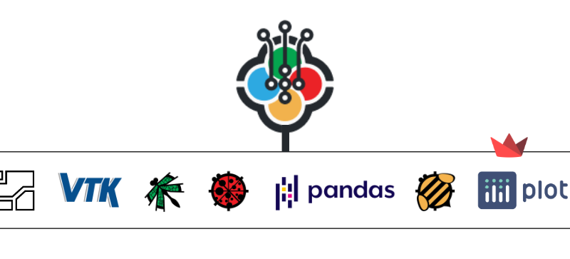

# Getting Started with Apps

### Introduction

This section gives a high level idea about Pollination apps, the knowledge needed to build them, and how to get started if you want build them.

### What is a Pollination App?

A Pollination app is a way to capture a workflow in a web application. Examples of these workflows are customized weather data visualization, running simulations on models prepared in a CAD environment, post-processing the results of a simulation, and visualizing the results back into the CAD environment.

### Pollination App examples

[These](https://app.pollination.cloud/apps) are some of the public apps developed by the Pollination team. Try one or many of these apps in your web browser and get trial [licenses](https://app.pollination.cloud/cad-plugins) from Pollination to see how these apps work inside your CAD environments.

### How do you share an app with your organization or your users?

Pollination handles distribution of apps for you. Once you have written an app, with pollination resources, you can deploy these apps to Pollination cloud in minutes and the app will be available to your organization or your users on the web and their CAD environments using Pollination CAD plugins. By default, a deployed app is public to everyone. However, you have the choice to make it private to your organization.

### What are the prerequisite to develop a Pollination app?

1. You need to have a Pollination account. If you don't have one, you can create one for free by following the steps [here](https://docs.pollination.cloud/user-manual/get-started/create-a-pollination-account).
2. You need to know enough python to work with the API of [Ladybug tools](https://discourse.ladybug.tools/pub/ladybug-tools-core-sdk-documentation) and [Streamlit](https://docs.streamlit.io/library/api-reference) and any other library you wish to use in your app.
3. You need to know how to write and run a Streamlit app. Look [here](https://docs.streamlit.io/library/get-started) to get started.

### What if you don't know enough to build a Pollination app?

We recommend looking at [freecodecamp](https://www.youtube.com/c/Freecodecamp/search). They have great tutorials on Python, Streamlit and other data science libraries that you might be interested in using in your apps.

### How to start developing a Pollination app?

We have several public [examples](https://github.com/pollination-apps) of apps deployed on Pollination. Make sure to look at these examples to get an idea of how to put together an app. Next, you will see guides for several of the common workflows used in most of the apps.

