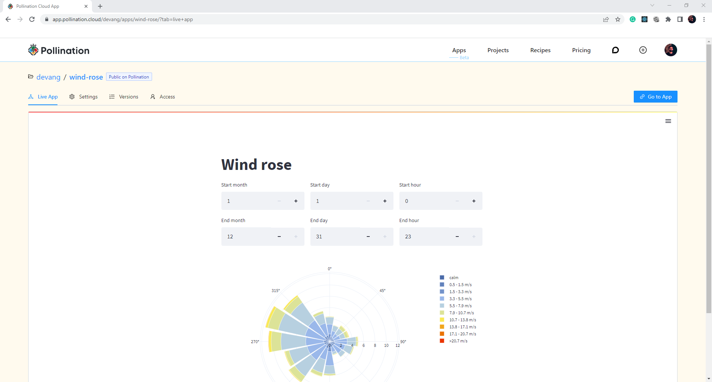

# Update App

In this section, we will see how update an app and use automated deployment to update the already deployed app on Pollination. This section builds on the [previous](automate-app-deployment.md) section and therefore assumes that you have already completed the previous section.

### Step-1 Update App locally

Go to your locally cloned wind-rose repository. Go inside the "app" folder and update the app.py to have the following code. Here, we have updated the app to filter the wind rose based on the analysis period.

```python
import streamlit as st
from ladybug.epw import EPW
from ladybug.windrose import WindRose
from ladybug.analysisperiod import AnalysisPeriod


st.set_page_config(
    page_title='Wind rose'
)

st.title("Wind rose")

col1, col2, col3 = st.columns(3)

with col1:
    st_month = st.number_input(
        'Start month', min_value=1, max_value=12, value=1, key='windrose_st_month')
    end_month = st.number_input(
        'End month', min_value=1, max_value=12, value=12, key='windrose_end_month')

with col2:
    st_day = st.number_input(
        'Start day', min_value=1, max_value=31, value=1, key='windrose_st_day')
    end_day = st.number_input(
        'End day', min_value=1, max_value=31, value=31, key='windrose_end_day')

with col3:
    st_hour = st.number_input(
        'Start hour', min_value=0, max_value=23, value=0, key='windrose_st_hour')
    end_hour = st.number_input(
        'End hour', min_value=0, max_value=23, value=23, key='windrose_end_hour')


lb_ap = AnalysisPeriod(st_month, st_day, st_hour, end_month, end_day, end_hour)


epw = EPW("./assets/sample.epw")
wind_directions = epw.wind_direction.filter_by_analysis_period(lb_ap)
wind_speeds = epw.wind_speed.filter_by_analysis_period(lb_ap)


wind_rose = WindRose(wind_directions, wind_speeds)
figure = wind_rose.plot()


st.plotly_chart(figure, use_container_width=True)
```

### Step-2 Commit changes

Open Github desktop and go to your wind-rose repository. You should see the changes appear. In the diff checker on the right, note the changes that have been made to the app. Also note the commit message. Since we added the capability to use analysis period to filter the wind rose, we are using the `feat` commit type.Also, since the change is only made in the app.py, we're using the file name in the commit scope. The full commit message here is;

`feat(app.py): add analysis period to filter wind rose`


Click on the "Commit to master" and then "Push to origin".

That's it. You should see a new version of the app deployed on Pollination in 5-10 minutes with the changes we made.


