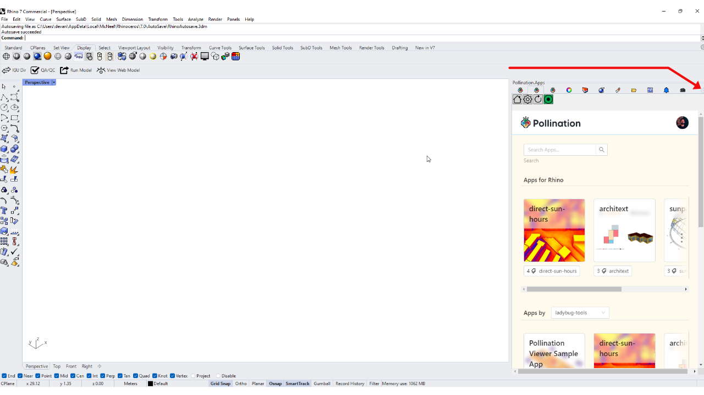
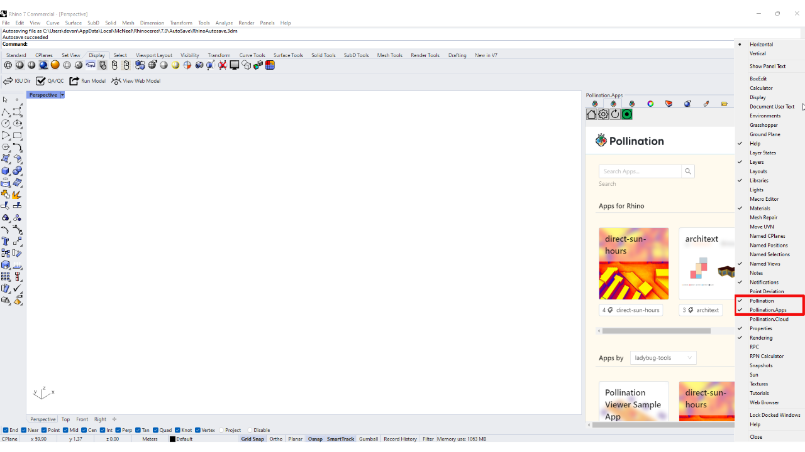
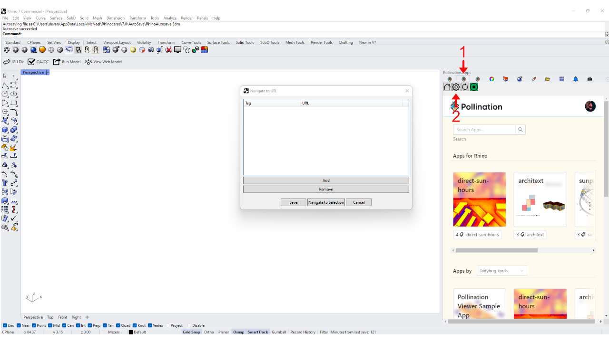
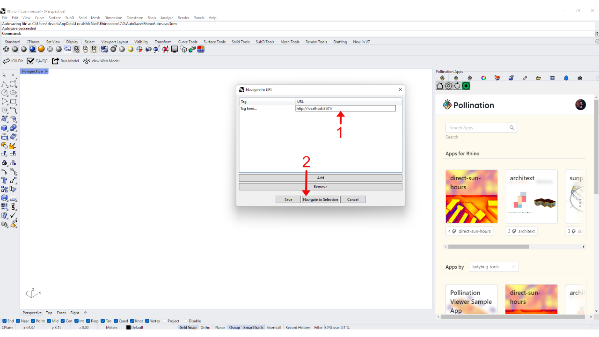

# Visualize Results in Rhino

In [this](download-output.md) section, we downloaded the "visualization" output of a daylight-factor study in the web app. Now, we will see how we can download the "result" output and visualize it in Rhino.

### Data needed for this visualization

Using the steps mentioned [here](download-output.md), download the "results" output of the daylight-factor study instead of the "visualization" output.


This should give you a results folder with the following structure:

```
results
│   grids_info.json
│
├───room_1
│       TestRoom_1.res
│
└───room_2
        TestRoom_2.res
```

We will also need the original HBJSON file used for the daylight-factor study in [this](create-job.md) step.

### App

Installing necessary libraries

```python
pip install pollination-streamlit-io lbt-honeybee
```

importing libraries

```python
import json
import streamlit as st
from typing import List
from pathlib import Path
from honeybee.model import Model as HBModel
from pollination_streamlit_io import button, inputs, special
```

Helper function to send a Honeybee model to Rhino

```python
def rhino_hbjson(hb_model: HBModel, label: str = 'Preview model',
                 key: str = 'model') -> None:
    """Visualize and bake HBJSON in rhino.

    args:
        hb_model: A honeybee model.
        label: Label of the button. Defaults to 'Preview model'.
        key: Key of the button. Defaults to 'model'.
    """

    if not st.session_state.host == 'rhino':
        return

    col1, col2 = st.columns(2)

    with col1:
        inputs.send(
            data=hb_model.to_dict(),
            unique_id='preview-model',
            default_checked=True,
            is_pollination_model=True,
            label=label,
            key=key,
        )

    with col2:
        button.send(
            action='BakePollinationModel',
            data=hb_model.to_dict(),
            unique_id='bake-model',
            options={
                "layer": "hbjson",
                "units": "Meters"
            },
            key=f'bake-{key}',
        )
```

Helper function to send results as a colored mesh in Rhino

```
def rhino_mesh(hb_model: HBModel, results_folder: Path, result_name: str) -> None:
    """Visualize and bake the mesh in Rhino

    Args:
        hb_model: A honeybee model.
        results_folder: Path to the folder where the results are stored.
        result_name: The name of the result to be loaded as mesh.
    """

    if not st.session_state.host == 'rhino':
        return

    grids_info_file = results_folder.joinpath('grids_info.json')
    info = json.loads(grids_info_file.read_text())
    model = hb_model.to_dict()

    grids = model['properties']['radiance']['sensor_grids']

    geometries = []
    merged_values = []
    for i, grid_info in enumerate(info):
        result_file = results_folder.joinpath(f"{grid_info['full_id']}.res")
        values = [float(v) for v in result_file.read_text().splitlines()]
        mesh = json.dumps(grids[i]['mesh'])
        merged_values += values
        geometries.append(json.loads(mesh))

    result_json = {
        "type": "AnalyticalMesh",
        "mesh": geometries,
        "values": merged_values
    }

    col1, col2 = st.columns(2)

    with col1:
        inputs.send(
            data=result_json,
            unique_id='preview-mesh',
            default_checked=True,
            label=result_name,
            delay=1000,
            key=result_name
        )

    with col2:
        button.send(
            action='BakeGeometry',
            data=result_json,
            unique_id=f'bake_{result_name}',
            key=result_name)
```

Helper function to send a Honeybee model and the results as a colored mesh in Rhino

```
def visualize_model_with_mesh(hbjson_path: Path,
                              result_folders: List[Path] = None,
                              result_names: List[str] = None,
                              show_rhino_mesh: bool = False):
    """Visualize the Honeybee model in Rhino with colored mesh.

    The result_folders and result_names accept a list of values. This is for the
    reason that you can mount multiple results on the same model. An example would
    be to mount the results of DA, sDA, and UDI on the same model.

    args:
        hbjson_path: Path to the HBJSON file.
        result_folders: List of paths to the folder where the result files are written.
            This is only used in creating colored mesh in Rhino.
        result_names: List of names of the result files. This is only used in creating
            colored mesh in Rhino. Defaults to None which means the names will be
            assigned based on the order of the result files.
        show_rhino_mesh: Boolean to show the mesh in Rhino or not. Defaults to False.
    """

    hb_model = HBModel.from_hbjson(hbjson_path.as_posix())
    rhino_hbjson(hb_model)

    if show_rhino_mesh:
        if not result_names:
            result_names = [f'result_{i}' for i in range(len(result_folders))]
        for count, result_folder in enumerate(result_folders):
            rhino_mesh(hb_model, result_folder, result_names[count])
```

Getting the host and saving in [session state](https://docs.streamlit.io/library/api-reference/session-state). Here, the host is Rhino. We need this to make the Streamlit app aware of the context. In this case, the Rhino environment.

```python
st.session_state.host = special.get_host()
```

Finally, visualizing the model and the results as a mesh in Rhino

```python
with st.form('visualize-rhino'):
    hbjson_path = Path(st.text_input('Path to HBJSON file'))
    results_path = Path(st.text_input('Path to results folder'))

    submit_button = st.form_submit_button(
        label='Submit')

    if submit_button:
        visualize_model_with_mesh(hbjson_path, [results_path], [
                                  'daylight-factor'], show_rhino_mesh=True)
```

### Testing the App inside Rhino

First, run the pollination app. Here, were assuming that the name of the python file for the app is "app" and the file is in the current working directory.

### Running the app

```python
streamlit run app.py
```

This should run the app at the following location in your browser:

```html
http://localhost:8501/
```

### Running the App inside Rhino

If you don't have already, download the Pollination Rhino plugin from [here](https://www.pollination.cloud/rhino-plugin). Once you install the Rhino plugin, you should see the tabs for "Pollination" and "Pollination.Apps" in the sidebar of Rhino. If you don't, click on the gear icon shown in the image below;&#x20;



Select the "Pollination" and "Pollination.Apps" on the menu that opens up&#x20;



Next, click on the gear icon in Pollination.Apps. This will open up a new window.&#x20;



In the panel, add the URL where the app is running and click on "Navigate to selection".&#x20;



This should show the app inside Rhino.


Enter, the following values assuming the HBJSON file and the results are present in the current working directory. If not, provide full path to both.


### Visualization in Rhino

Clicking the 'Submit" button should show the model and the mesh in Rhino that you can tun on and off and also bake as Rhino objects.&#x20;


