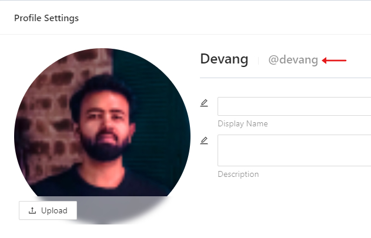
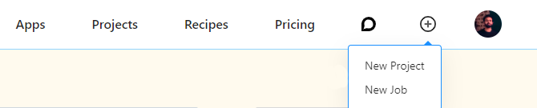
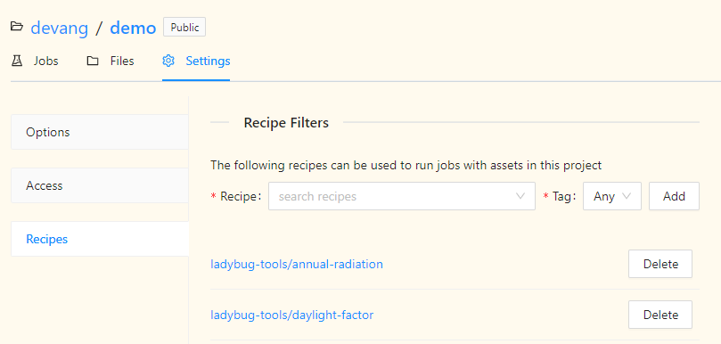

# Create a Study

In this section, we will see how you can schedule a simulation aka a job, on Pollination cloud from your Pollination app. A Job on Pollination can be created using the Pollination credentials, job inputs,and recipe inputs.

### Step-1: Pollination Credentials

API key: A user of your app can find a Pollination API key in the "Developer Settings" section under the "Settings" tab of their profile on Pollination. If they don't have a key, they can generate one by entering any name for the key and clicking on the "+" button. Once they have this key, they can copy it to the clipboard and paste it back to the Pollination-app.


Owner Name: The owner name is the username of the user who is scheduling this job on Pollination. This username too can be found in the "Profile Settings" section of the "Settings" tab on Pollination. The username is typically followed by a "@" on the "Profile Settings".



### Step-2: Job Inputs

Project: The project name is name of the project the scheduled job will go into. A user can create a project on Pollination by clicking on the "+" button on the navigation bar at the top. If a project already exists, the user can use that project's name.



Job name: Any text to name the job.

Job description: Any text to describe the job.

### Step-3: Recipe Selection

A recipe needs to be selected and added to the project before it can be used. A recipe can be added to the project by going to the "Recipes" on the "Settings" tab of the project.



Recipe owner: The owner of the recipe. You will find several public recipes developed by the ladybug tools team on Pollination. If you develop and deploy a recipe, the owner name here will be your username.

Recipe name: Name of the recipe you want to use for the job.

Recipe tag: The version tag of the recipe you want to use for the job.

### Step-4: Recipe Inputs

Visit any [recipe](https://app.pollination.solutions/recipes) on Pollination to find out the inputs for the recipe

### Step-5: Scheduling a Job

We will create a job on Pollination to run the [daylight-factor](https://app.pollination.solutions/ladybug-tools/recipes/daylight-factor) recipe on the gridbased model that ships with Ladybug Tools.

Install the following libraries first

```python
pip install streamlit pollination-streamlit
```

Importing necessary libraries

```python
import streamlit as st
from pathlib import Path
from pollination_streamlit.api.client import ApiClient
from pollination_streamlit.interactors import NewJob, Recipe
```

Helper function to add a recipe to a job

```python
def add_recipe_to_job(new_job, recipe_arguments, recipe_artifacts) -> NewJob:
    """Add recipe arguments and artifacts to a job.

    args:
        new_job: A NewJob object.
        recipe_arguments: A dictionary of recipe arguments.
        recipe_artifacts: A dictionary of recipe artifacts where each items is a
            dictionary where the key is the name of the input on the recipe and the
            values are the paths to artifact and the path to the target folder on
            Pollination.

    returns:
        A NewJob object with the recipe arguments and artifacts added.
    """

    for key, val in recipe_artifacts.items():
        item = new_job.upload_artifact(
            val['file_path'], val['pollination_target_path'])
        recipe_arguments[key] = item

    new_job.arguments = [recipe_arguments]

    return new_job
```

Create a Streamlit form to collect inputs from the user and submit the job

```python
with st.form('daylight-factor-job'):

    st.markdown('Pollination credentials')
    api_key = st.text_input(
        'Enter Pollination API key', type='password')
    owner = st.text_input('Project Owner')
    st.markdown('---')

    st.markdown('Job inputs')
    project = st.text_input('Project Name')
    job_name = st.text_input('Job Name')
    job_description = st.text_input('Job Description')
    st.markdown('---')

    st.markdown('Recipe selection')
    recipe_owner = st.text_input('Recipe Owner', value='ladybug-tools')
    recipe_name = st.text_input('Recipe Name', value='daylight-factor')
    recipe_tag = st.text_input('Recipe Version', value='latest')
    st.markdown('---')

    st.markdown('Recipe inputs')
    # TODO: This will change based on the recipe you select
    cpu_count = st.number_input('CPU Count', value=50)
    grid_filter = st.text_input('Grid Filter', value='*')
    min_sensor_count = st.number_input('Min Sensor Count', value=200)
    hbjson_data = st.file_uploader('Upload HBJSON')
    rad_parameters = st.text_input('Rad Parameters',
                                   value='-ab 2 -aa 0.1 -ad 2048 -ar 64')
    # TODO: change ends

    submit_button = st.form_submit_button(
        label='Submit')

    if submit_button:
        # create HBJSON file path
        hbjson_file = Path('.', 'model.hbjson')
        # write HBJSON file
        hbjson_file.write_bytes(hbjson_data.read())

        # recipe inputs
        # TODO: This will change based on the recipe you select
        arguments = {
            'cpu-count': cpu_count,
            'grid-filter': grid_filter,
            'min-sensor-count': min_sensor_count,
            'radiance-parameters': rad_parameters,
        }

        # recipe inputs where a file needs to be uploaded
        artifacts = {
            'model': {'file_path': hbjson_file, 'pollination_target_path': ''}
        }
        # TODO: change ends

        api_client = ApiClient(api_token=api_key)
        recipe = Recipe(recipe_owner, recipe_name, recipe_tag, api_client)
        new_job = NewJob(owner, project, recipe, name=job_name,
                         description=job_description, client=api_client)
        new_job = add_recipe_to_job(new_job, arguments, artifacts)
        job = new_job.create()
```

The above code will render the following Streamlit form that can be used to submit a job on Pollination to run the daylight-factor recipe.


A job submitted using this form can be accessed [here](https://app.pollination.solutions/devang/projects/demo/jobs/53498657-5da8-4308-86ce-e9fb4b9c0fc8).
