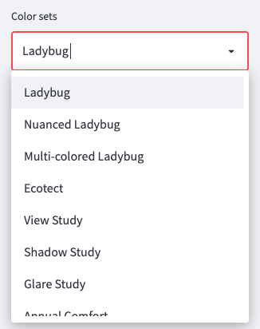

# Integrate the Pollination Viewer

### Pollination Viewer Usage

Pollination App developers can easily integrate the same high performance 3D web viewer that we use throughout our apps in their own work. We offer both a Streamlit component and a React component that can be used by the Pollination community.

The Streamlit component is [published on PyPi](https://pypi.org/project/pollination-streamlit-viewer/), and our React component is [available on npmjs](https://www.npmjs.com/package/lavender-vtkjs).

The Streamlit component can be installed by executing the following command:

```shell
pip install pollination-streamlit-viewer
```

The first resource you should know about is the sample viewer app:\


The code for this app is located here:\


This app exposes all of the configurations and features of pollination-streamlit-viewer.

Here's a screenshot of the viewer:


### Instantiating the Viewer in Streamlit

```python
from pollination-streamlit-viewer import viewer
#...

def viewer(
     key: str, *,
     content: bytes = None,
     toolbar: bool = True,
     sidebar: bool = True,
     subscribe: bool = False,
     clear: bool = True,
     action_stack: list = [],
     style: Dict = None)
```

| Argument      | Description                                                                                                                                                                                         |
| ------------- | --------------------------------------------------------------------------------------------------------------------------------------------------------------------------------------------------- |
| key           | A unique string for each instance of the viewer.                                                                                                                                                    |
| content       | A `.vtkjs` file (see the section below Loading a File)                                                                                                                                              |
| toolbar       | A `boolean` that toggles the toolbar visibility. Default is `True`.                                                                                                                                 |
| sidebar       | A boolean that toggles the sidebar visiblity. Default is `True`.                                                                                                                                    |
| subscribe     | A boolean that toggles subscription to the VTKJS camera and renderer content. Default is `False`.                                                                                                   |
| clear         | A boolean to clear the current contents from the viewer before loading new content. Default is `True`.                                                                                              |
| action\_stack | The action stack is an advanced feature that allows the streamlit component to send actions to the React component's dispatch function. A set of useful actions are demonstrated in the sample app. |
| style         | A dictionary to set the style for the viewer. The key and values can be any CSS style attribute. Default is: `{"height" : " 640px", "border": "1px solid #d0d7de", "borderRadius": "2px"}`          |

### Return Value

The value returned by `viewer` represents the scene that has been loaded into the viewer. This object is represented as a deeply nested dictionary with fields that often follow the structure of vtk.js objects. By default, this state will contain a single value called scene with an array of all the actors in the scene. This default return value will not update as you update the scene using the viewer controls. This is useful for reading default values, and `actor[id]`s. Those `actor[id]`s are used by some actions to modify actor properties.

If you want to read and respond to values as the viewer state changes, use the `subscribe` toggle described below.

#### Loading a File

You can make use of the Streamlit provided st.file\_uploader component to load a .vtkjs file.

```python
_file = st.file_uploader(
     label=".vtkjs scene uploader",
     type=["vtkjs", "vtk", "vtp"],
     help="Upload a .vtkjs scene file"
)

#...

content = _file.getvalue() if _file else None
```

#### Visualizing an hbjson model using get\_hbjson

Another package, [pollination-streamlit-io](https://pypi.org/project/pollination-streamlit-io/), provides a component called `get_hbjson` that can be used to get an hbjson model either from the web, or one of the Pollination CAD plugins. After getting the hbjson model, you will have to transform it into a vtkjs file that can be rendered by the Pollination viewer. [Check out our sample app that demonstrates some of the following code.](https://github.com/pollination-apps/get-view-hbjson-tutorial).

There is a "gotcha" here that can cause the pollination-viewer to rerender the model multiple times unecessarily, and can sometimes cause your app to crash. We can fix the problem by using features of Streamlit that will help prevent the app from unecessarily receiving new versions of the same model.

Using @st.cache:

```python
path = './temp'

@st.cache
def model_from_path(path):
    vtk_model = VTKModel.from_hbjson(path)
    vtk_path = vtk_model.to_vtkjs(folder=path, 
        name=model.identifier)
    return vtk_path

hbjson_data = get_hbjson(key='hbjson_data')

content = None

if hbjson_data is not None:
    model = Model.from_dict(hbjson_data['hbjson'])
    path = model.to_hbjson(folder=FOLDER, name=model.identifier)
    content = Path(model_from_path(path)).read_bytes()

viewer(
    content=content,  
    key='vtkjs-viewer',
    subscribe=False,
    style={
        'height' : '640px'
    }
)
```

An alternative way to solve this problem is to use the on\_change callback that is an optional argument to the get\_hbjson component:

```python
if 'content' not in st.session_state:
    st.session_station.content = None

def get_hbjson_on_change(path):
    # callback has access to hbjson_data
    hbjson_data = st.session_state['hbjson_data']
    # convert to a honeybee model
    model = Model.from_dict(hbjson_data['hbjson'])
    path = model.to_hbjson(folder=path, name=model.identifier)
    # read hbjson file
    content = Path(model_from_path(path)).read_bytes()
    # create a vtk model using honeybee-vtkjs
    vtk_model = VTKModel.from_hbjson(path)
    vtk_path = vtk_model.to_vtkjs(folder=path, 
        name=model.identifier)
    st.session_station.content = Path(model_from_path(path)).read_bytes()

# can also supply kwargs using kwargs parameter
hbjson_data = get_hbjson(key='hbjson_data', on_change=get_hbjson_on_change, args=['./temp'])

viewer(
    content=st.session_station.content,  
    key='vtkjs-viewer',
    subscribe=False,
    style={
        'height' : '640px'
    }
)
```

#### Caching vtkjs models using st.session\_state

If your app generates an hbjson model programatically, you can cache the generated vtk.js models using st.session\_state.

```python
def show_model():
    model = Model.from_dict(hbjson_data['hbjson'])
    id = model.identifier

    if id not in st.session_state:
        path = model.to_hbjson(folder=path, name=model.identifier)
        content = Path(model_from_path(path)).read_bytes()
        vtk_model = VTKModel.from_hbjson(path)
        vtk_path = vtk_model.to_vtkjs(folder=path, 
            name=model.identifier)
        vtkjs = Path(model_from_path(path)).read_bytes()
        st.session_state[id] = vtkjs
    else:
        return st.session_state[id]
```

### Subscribe Toggle

The subscribe toggle is a powerful feature that may be easy to misuse. If set, the value returned by st\_vtkjs will contain additional fields.


These fields contain information about the renderer, legend, and "widgets" (the compass rose and section planes) and will update as you make changes to the scene. Be warned! This toggle can easily cause your app to go into an infinite rendering loop as the component responds to changes and returns new values. See the last section of this guide Gotchas: Controlling Component Re-rendering.

None of the features in the Sample Viewer App require the subscribe toggle to be set to True, so it shouldn't be necessary in most apps. A scenario in which it might be useful would be if you had a chart elsewhere in the app, and you wanted its min / max values (or color scheme) to stay in sync with the viewer legend's min / max values.

### Action Stack

The action stack is an advanced feature that allows you to send actions to the viewer's dispatch function. Our Streamlit component executes each action once as they are added to the `action_stack` array. There are a bunch of examples of common things you might want to do in the Sample Viewer App, the full list of available actions will develop over time with the viewer itself. Check the viewer's reducer function for the full list of available actions.

Here's an example of how to set the colorset from streamlit using the `action_stack`:

```python
def handle_colorset ():
    if 'colorset_select' in st.session_state:
        st.session_state.action_stack.append({
        'type': 'color-set',
        'value': st.session_state.colorset_select,
    })

#...

st.selectbox('Color sets', COLORSETS, key='colorset_select', on_change=handle_colorset)
```

This renders the select box in the right hand sidebar:



Please be aware, that if you've set the `subscribe` toggle to `True` this will cause the component to rerender. Please see the previous section on the Subscribe Toggle or the next section Gotchas: Controlling Component Re-Rendering for more information.

### Gotchas: Controlling Component Re-Rendering

By default when the value of variables in Streamlit change, often in response to user input, the component will re-render. When a component like `st_vtkjs` returns input back to Streamlit, it can easily cause an infinite loop of rendering that will cause the Streamlit app to report "Running..." in the top right corner of the app. This will eventually cause the app to fail. To control this behavior there are two techniques that you should employ.

First, use `st.session_state` to prevent a variable from being reinitialized when the app responds to other changing values. st.session\_state is a feature of Streamlit, and you can look to their docs to learn more about this feature.

Each Streamlit input component can use it's own session state automatically.

```python
toolbar = st.checkbox('Toolbar', value=True, key='toolbar_toggle', help='Show/Hide the toolbar.')

#...

vtkjs = st_vtkjs(
    toolbar=st.session_state.toolbar_toggle,
)
```

You can also use `st.session_state` yourself.

```python
if 'action_stack' not in st.session_state:
  st.session_state['action_stack'] = []

#...

with vtkjs_container:
  vtkjs = st_vtkjs(
        action_stack=st.session_state.action_stack,
    )
```

The second strategy: don't set the `subscribe` toggle unless you absolutely need to. All of the controls in the Viewer Sample work without this toggle. It is rarely necessary and if you choose to use it, you should know the ins and outs of this problem.

### Report Bugs

These software are both under active development, please report bugs on the [Pollination forum](https://discourse.pollination.cloud/).
