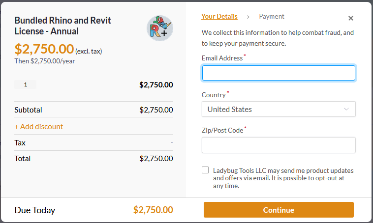

# 5. Buy Rhino and Revit Plugins Licenses


[Watch this video](https://www.youtube.com/watch?v=Bb92mEcq4pw) to better understand how Pollination licensing and pricing work. It also covers the difference between organization seats and Rhino and Revit licenses.


## Purchasing the CAD Plugins


You have the option to buy the CAD plugins under your personal account or an organization account. If you want to share the license among several users, it must be purchased under an organization account.


### Step 1

Click on your avatar on the top right of the page, and select the correct account. If you want to share the license among several users, it must be purchased under an organization account.

<figure><figcaption>
Switch to the organization account
</figcaption></figure>

### Step 2

Click on the dropdown menu and select Your Subscriptions. \\

<figure><figcaption></figcaption></figure>

### Step 3

Scroll down to the Plugin Subscriptions section. You can purchase the licenses for Rhino and Revit plugins separately or buy a bundled license at a lower price.

<figure><figcaption>
Plugins Subscriptions
</figcaption></figure>

### Step 4

Select the billing period, choose the number of floating licenses, and click on the `Subscribe` button.

<figure><figcaption></figcaption></figure>


The annual billing offers a free month of subscription.



If you are buying plugins for multiple CAD software, you'll have to repeat Steps 2 and 3 for each plugin at this time.


### Step 5

Input your information in the payment form and press `Continue`.

If you have a coupon code, add it to your cart by clicking on `+ Add discount` before completing your purchase.


Congratulations! Once payment is processed, you should see the license under your account. If the screen doesn't automatically update, hit the refresh button on your screen to access the _Manage_ and _Payment_ tabs for your subscriptions.



Once you complete payment, you will receive an email from Ladybug Tools (via Paddle.com) with a link to your invoice/receipt. Please check your spam and junk folders after making your payment if you don't see an email confirmation in your inbox.

