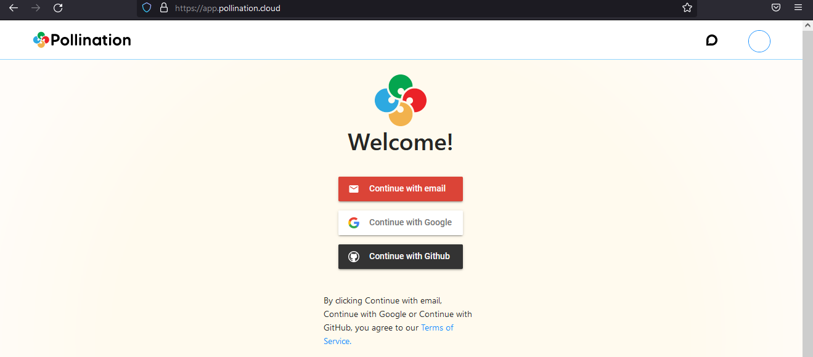
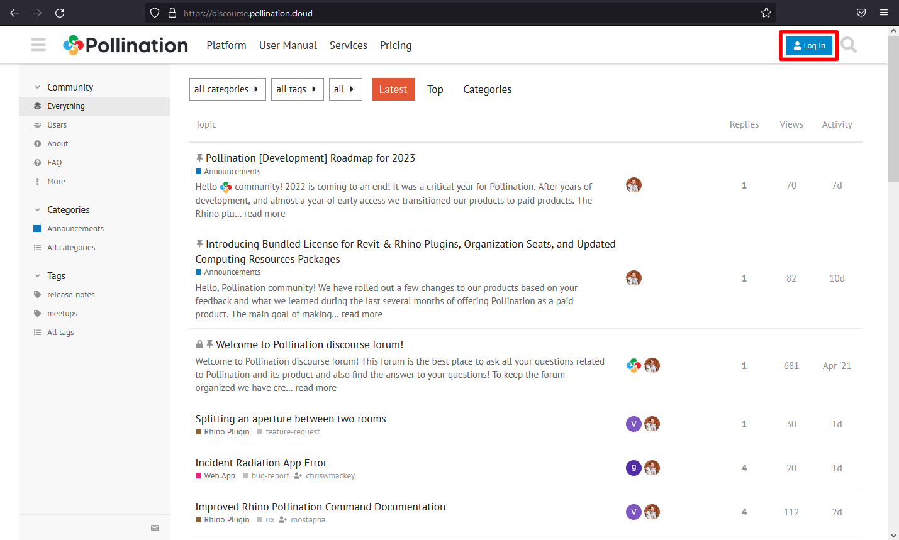

# Create a Pollination Account

You'll need a Pollination account to access all features of the Pollination ecosystem. This includes joining an organization, downloading plugins, using cloud simulation resources, and participating in the forum. Luckily, you can join for **free**! The Starter account gives you a limited amount of cloud computing resources and access to the Pollination ecosystem. To get the most out of Pollination, consider creating an **Organization** account and add additional seats or computing packages.

Check out our [pricing page](https://www.pollination.solutions/pricing-platform) to learn more about the Pollination products!

Visit [https://app.pollination.solutions/](https://app.pollination.solutions/) and choose your preferred method for signing up. We currently support sign-up via email, with a Google account, or a GitHub account.

You need to input additional information about yourself when you create your account for the first time.


You should receive a verification email from Firebase after creating the account to verify your email address. Please check your spam and junk folders if you don't see an email confirmation in your inbox.

We have also seem that some IT department block this email from Firebase. You may need to get in touch with your IT team in case you don't see the email in the spam of junk folders.


## Create a Discourse Account

After creating your Pollination account you also need to log-in to [Pollination Discourse](https://discourse.pollination.solutions) page to be able to post your questions, interact with the other Pollination users. Go to the address above and click on the log-in button on the top right of the screen. Use the same method and information that you used to create your Pollination account to log-in to Discourse.

