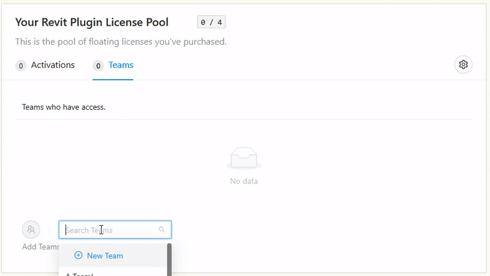

# 6. Share Rhino and Revit Plugins Licenses


This section is only applicable to licenses that are purchased under an organization account. A license that is purchased under a personal account can only be used by the account owner.


Since all Pollination CAD licenses for an Organization are floating licenses, several organization members can share a license to use at different times. The "Super Admin" members in the organization can immediately access the licenses from within their chosen CAD interface. To share access within an organization, with the rest of the organization members, the Super Admin or License Admin must add them to the License Pool.

This page shows the process of adding team members to the License Pool.


Pollination manages all access to a project by using teams. It is required to [create a team](account-setup/create-teams.md) first before being able to add them to the project.


## Step 1

Click on the dropdown menu next to your avatar and select _License Pools._

<figure><figcaption>
Click on the dropdown menue next to your avatar and select License Pools
</figcaption></figure>

## Step 2

Add teams to your license pool by clicking on the _Teams_ tab and typing the team name in the search box. Once you find the team you'd like to add, click on the blue circle icon to add the member to your license pool.

<figure><figcaption></figcaption></figure>

You can always remove the team by clicking on the small red trash icon.

<figure><figcaption>
Remove teams from the Pool
</figcaption></figure>
