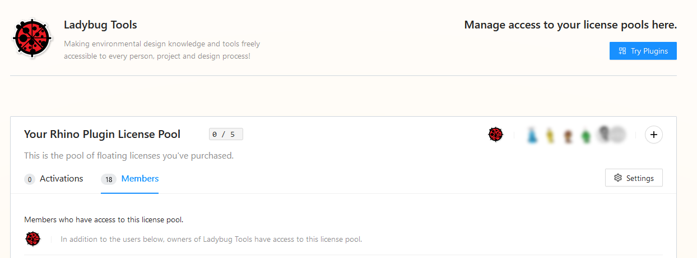
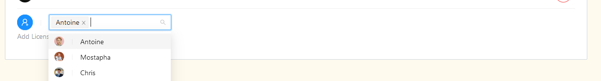
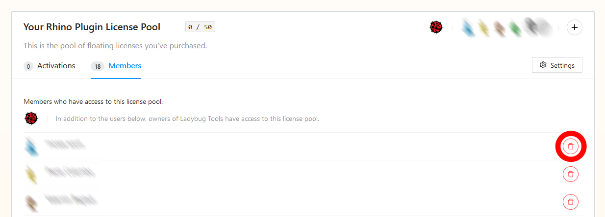

# 5. Manage License Pools


This section is only applicable to licenses that are purchased under an organization account. A license that is purchased under a personal account can only be used by the account owner.


Since all Pollination CAD licenses for an Organization are floating licenses, multiple organization members can share a license to use at different times. The owners of the organization can immediately access Pollination from within their chosen CAD interface. To share access within an organization the owner must add members to their organization and then the License Pool.

## Step 1

Click on the dropdown menu next to your avatar and select _License Pools._

<figure><figcaption>
Click on the dropdown menue next to your avatar and select License Pools
</figcaption></figure>

## Step 2

Add members to your license pool by clicking on the _Member_ tab and typing member names in the search box. Once you find the member you'd like to add, click on the blue circle icon to add the member to your license pool.

## Step 3

Once members are added, you can manage usage under the _Activations_ tab. You can always remove members by clicking on the trash can to the right of the screen.

