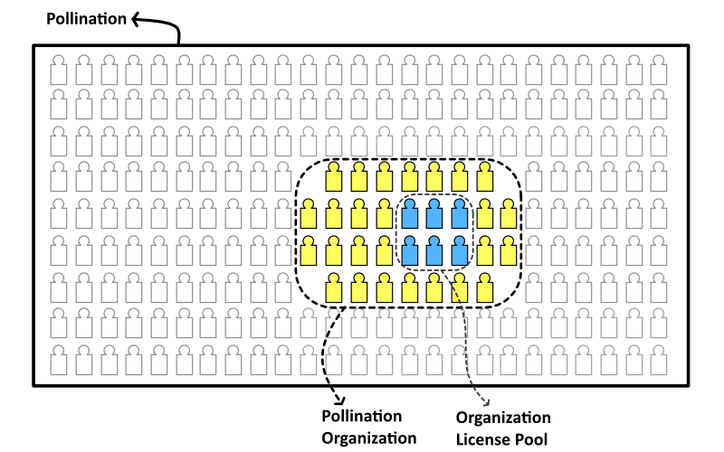

# Understanding Pollination Licensing Structure

Pollination has a hybrid licensing model to make it more affordable to share the license with more users. This includes both frequent users and occasional ones.

You start by choosing **concurrent use licenses** (AKA license). This determines how many authorized users can use the Pollination plugins simultaneously. Ask yourself, how many people on your team need to use the Pollination plugin at the same time. That is the number of concurrent use licenses that you need. You can find the pricing for licenses here: [https://pollination.solutions/pricing#cad-plugins](https://pollination.solutions/pricing#cad-plugins)

Then you add **additional authorized users** (AKA seats). This is the total number of people on your team who will be eligible to use the concurrent licenses. Each additional authorized user can be assigned to a single Pollination account. Ask yourself, how many total team members need access? If it is more than 1 user then you will need to buy additional seats.

The seats are priced much cheaper to give you the ability to share the license with a larger number of team members even if some of them might use the license occasionally but it doesn't change the number of concurrent licenses. You can find the pricing for seats here: [https://www.pollination.solutions/pricing#org-seats](https://www.pollination.solutions/pricing#org-seats)

After adding additional seats to your organization, you can add new members to the organization, and the license pool so they can check out a license from the license pool.&#x20;

Here is video recording that explains the licensing with some additional information and examples.



If you still have more questions about the licensing feel free to reach out to [contact us](https://www.pollination.solutions/contact) with any questions.
