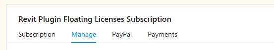

# Purchase and Manage CAD Plugins

Pollination plugins are required if you would like to use Pollination from within your CAD/BIM software. If you plan to use Pollination across more than one software package, you will need to purchase and download multiple installation files. For plugin pricing, please visit our [pricing page](https://www.pollination.solutions/pricing#cad-plugins).

## Purchasing the CAD Plugins


You have the option to buy the CAD plugins under your personal account or an organization account. If you want to share the license among several users it must be purchased under an organization account.


### Step 1

Click on your avatar on the top right of the page, and select the correct account. If you want to share the license among several users it must be purchased under an organization account.

<figure><figcaption>
Switch to the organization account
</figcaption></figure>

### Step 2

Click on the dropdown menu and select Your Subscriptions. \\

<figure><figcaption></figcaption></figure>

### Step 3

Scroll down to the Plugin Subscriptions section. You can purchase the licenses for Rhino and Revit plugins separately or buy a bundled license at a lower price.

<figure><figcaption>
Plugins Subscriptions
</figcaption></figure>

### Step 4

Select the billing period, and choose the number of floating licenses, and click on the `Subscribe` button.

<figure><figcaption></figcaption></figure>


The annual billing offers a free month of subscription.



If you are buying plugins for multiple CAD software, you'll have to repeat Steps 2 and 3 for each plugin at this time.


### Step 5

Input your information in the payment form and press `Continue`.

If you have a coupon code, add it to your cart by clicking on `+ Add discount` before completing your purchase.


Congratulations! Once payment is processed you should see the license under your account. If the screen doesn't automatically update, hit the refresh button on your screen to access the _Manage_ and _Payment_ tabs for your subscriptions.



Once you complete payment, you will receive an email from Ladybug Tools (via Paddle.com) with a link to your invoice/receipt. Please check your spam and junk folders after making your payment if you don't see an email confirmation in your inbox.


## Managing the CAD Plugins

Once you buy the CAD licenses you can use the license pools to manage the licenses. There are 4 tabs

* **Subscription**: Under _Subscription_, you can see the information about your current subscription.
* **Manage**: Under _Manage_, you can update or cancel your current subscription. You can cancel your subscription at any point in time but we will not be able to provide prorated refunds for your cancellation. See below for more information.
* **PayPal/Card**: The name of this tab will be different based on your method of payment. In both cases, you can use this tab to update your payment method.
* **Payments**: Under _Payment_, you can access both upcoming payments and past payments with links to a copy of your invoice.


Please review our cancellation policy in our [Terms of Service](https://www.pollination.solutions/terms-of-service) as we are unable to provide prorated refunds for subscription changes that occur earlier than the renewal date. All changes are effective immediately, so if you cancel or update the number of licenses you have, please do so as close to your renewal date as possible.

Updating the number of licenses also removes any coupons that might be applied to your original subscription.


## Sharing Floating Licenses

For organizations, you can share the license between the organization members. See [this page](../manage-license-pool.md) for more information.
