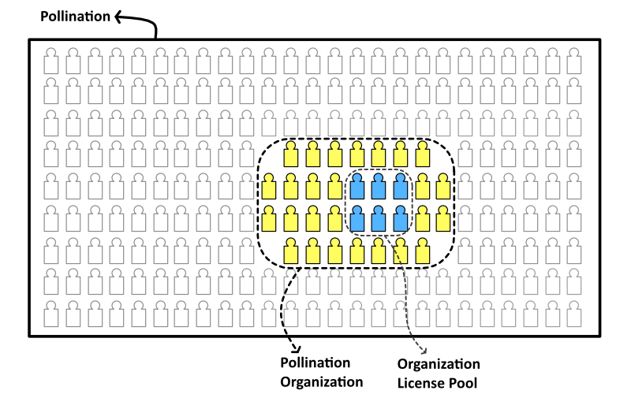

# Understanding Pollination Subscriptions Types

Pollination's hybrid licensing model allows companies to offer broad user access at a cost-effective price.


We understand that using a less common licensing structure might cause some confusion. After considering several options, we chose this hybrid license to ensure fair pricing and accessibility. We are aware of other licensing structures requiring a separate full license per user/computer. While we would make more money with such licenses, we decided against it. In return, we expect you respect the terms of our agreement and do not share your Pollination account among several users.



Pollination offers two complementary subscription types:

* **Concurrent Use Licenses**: This determines how many users can use CAD plugins simultaneously.
* **Additional Authorized Users**: This determines the total number of users eligible to use the licenses when they are not occupied by others in the organization.

## Concurrent Use Licenses

You should start by choosing the number of **concurrent use licenses**. This determines how many authorized users can use the Pollination plugins simultaneously.

Ask yourself, how many people on your team need to use the Pollination plugin at the same time. That is the number of concurrent use licenses that you need.

The current use licenses are available for the Rhino and Revit plugins. There is a also a bundled option that gives you access to both of them at a lower price: [You can find the pricing for concurrent use licenses here](https://pollination.solutions/pricing#cad-plugins).

## Authorized Users

Once you determined the number of concurrent use licenses, then you can add **authorized users**. This is the total number of people on your team who will be eligible to use the concurrent licenses. Each additional authorized user can be assigned to a single Pollination account.

Pollination organization includes one free authorized user. That means if you are the only user who will access the license you don't need to buy this subscription.

Ask yourself, how many total team members need access? If it is more than 1 user then you need to buy additional authorized users subscription for the organization.

The additional authorized users are priced much lower, allowing you to share the license with more team members, even if some only use it occasionally. Note that adding additional authorized users does not change the number of concurrent licenses. [You can find the pricing for additional authorized users here](https://www.pollination.solutions/pricing#org-seats).

After adding additional seats to your organization, you can add new members to the organization, and the license pool so they can check out a license when using the CAD plugins.&#x20;

## Examples

Let's go through a couple of examples:

### First example

You need a license of the Rhino plugin and a Revit plugin license  just for yourself as a single user.

In this scenario, purchase only a "Bundled Pollination Rhino and Revit Plugin Concurrent Use License." There is no need for any additional authorized user subscriptions.

### Second example

You have a team of 10 modelers, and you require 2 of them to use the Pollination Revit plugin at the same time.

In this scenario, purchase two "Pollination Revit Plugin Concurrent Use License" and one "10 Authorized User" package. Keep in mind that you will have 11 authorized users in total because the organization already includes 1 which is usually used by the IT to set up your organization.


We chose the "10 Authorized Users" package instead of purchasing nine "1 Authorized User" subscriptions because it's more cost-effective.


If you still have more questions about the licensing feel free to reach out to [contact us](https://www.pollination.solutions/contact) with any questions.

