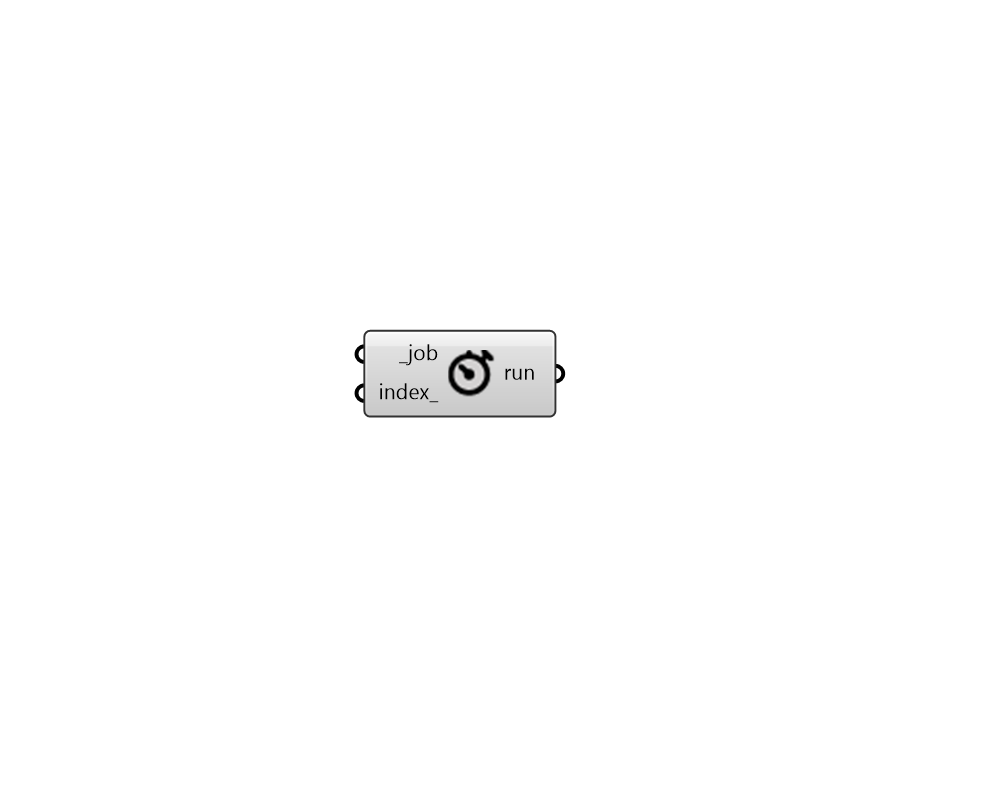

# Check Job Status

Check a Pollination job's runs status.

## Inputs

* **job \[Required\]**

  A Pollination job 

* **index**

  An index for getting a run's outputs from the job. By default, it gets the first run from list. Index starts with 0. 

## Outputs

* **run**

  An id of Pollination run. You can use CheckRunInputs or CheckRunResults to deconstruct the run's data. 

