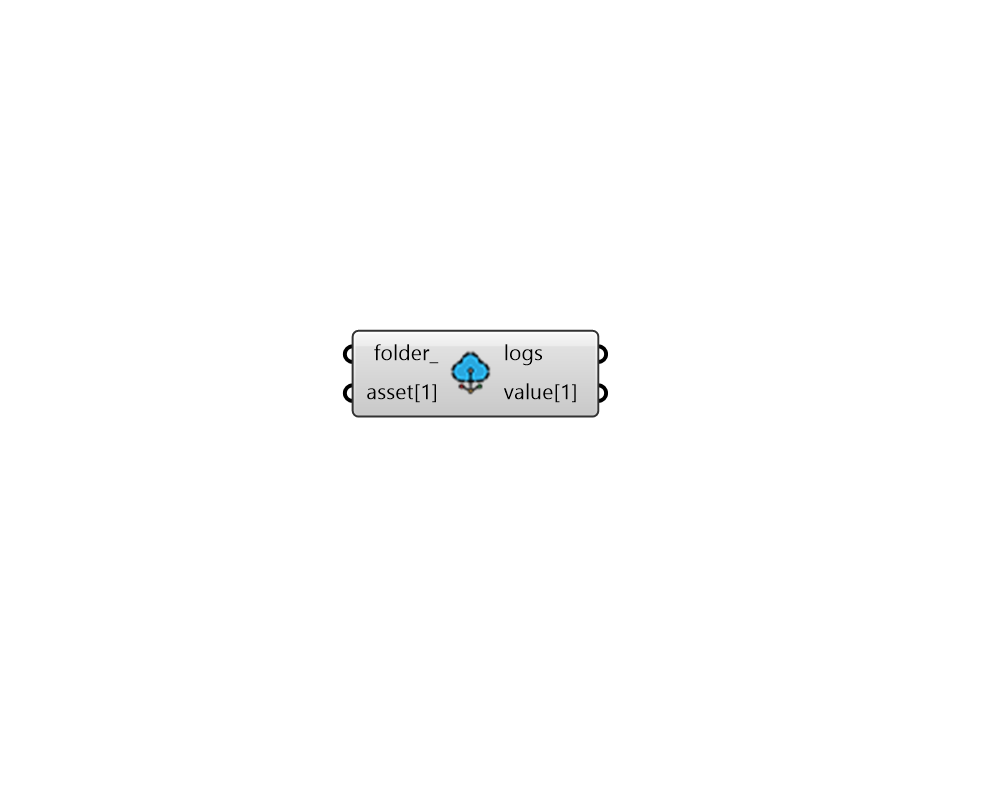

# 2:Pollination

*  [Check\_Run\_Inputs](../components/Check_Run_Inputs.md)
*  [Check\_Run\_Results](../components/Check_Run_Results.md)
*  [List\_Run\_Assets](../components/List_Run_Assets.md)
*  [Setup\_Runs](../components/Setup_Runs.md)
*  [User\_Data](../components/User_Data.md)
*  [Pollinate](../components/Pollinate.md)
*  [Check\_Study\_Status](../components/Check_Study_Status.md)
*  [List\_Studies](../components/List_Studies.md)
*  [Add\_a\_project](../components/Add_a_project.md)
*  [Get\_a\_project](../components/Get_a_project.md)
*  [List\_Project\_Assets](../components/List_Project_Assets.md)
*  [Load\_Assets](../components/Load_Assets.md)
*  [Upload\_Assets](../components/Upload_Assets.md)
* .png>) [Login](../components/Login.md)
