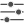
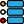

#### Component list:
*  [Check_Run_Inputs](../components/Check_Run_Inputs.md)
*  [Check_Run_Results](../components/Check_Run_Results.md)
*  [List_Run_Assets](../components/List_Run_Assets.md)
*  [Setup_Runs](../components/Setup_Runs.md)
*  [User_Data](../components/User_Data.md)
*  [Pollinate](../components/Pollinate.md)
*  [Check_Study_Status](../components/Check_Study_Status.md)
*  [List_Studies](../components/List_Studies.md)
*  [Add_a_project](../components/Add_a_project.md)
*  [Get_a_project](../components/Get_a_project.md)
*  [List_Project_Assets](../components/List_Project_Assets.md)
*  [Load_Assets](../components/Load_Assets.md)
*  [Upload_Assets](../components/Upload_Assets.md)
*  [Login](../components/Login.md)