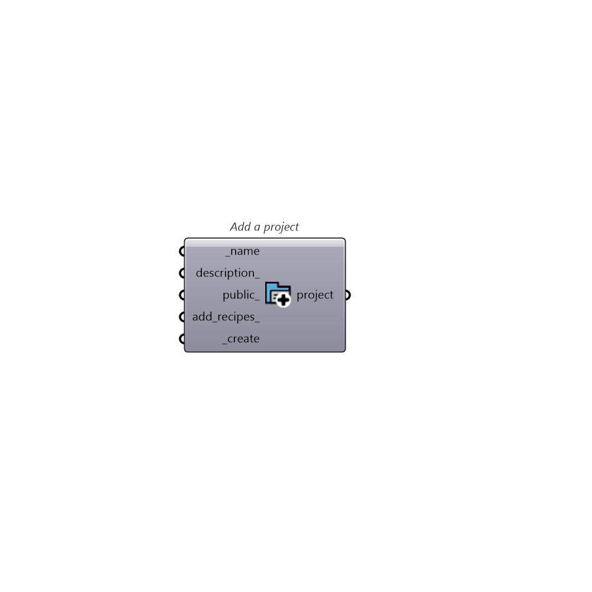

##  Add a project

Add a new project

### Inputs

* #### name [Required]

  Name for the new project. By default, the project will be added to the current user. To create a project under another account, you can specify the account name before the project name with the format: AccountName/ProjectName. For example: pollination/NewDemoProject

* #### description [Optional]

  The new project description

* #### public [Optional]

  Set to True to create a public project (Default: True)

* #### add_recipes [Optional]

  Set True to add all public recipes to the project (Default: False) WARNING: adding all the public recipes to the new project would take a few seconds.

* #### create [Required]

  Set True to create the project

### Outputs

* #### project

  Newly created project.
