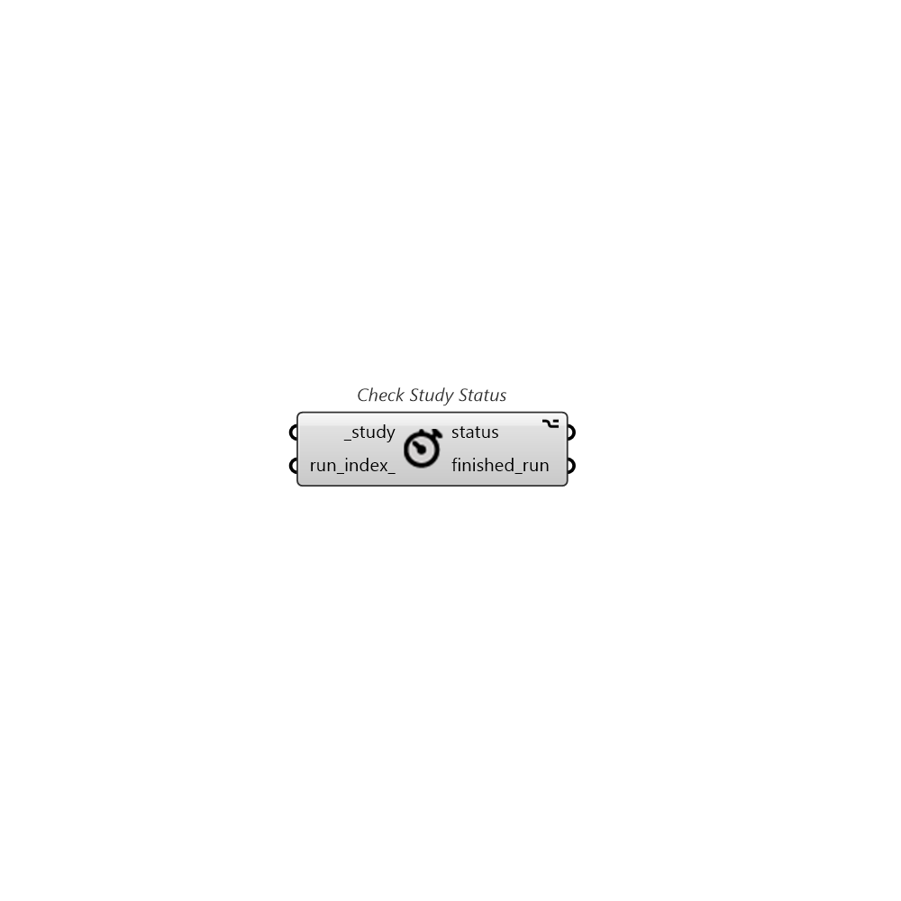

##  Check Study Status

Check a Pollination study's runs status.

### Inputs

* #### study [Required]

  A Pollination study

* #### run_index [Optional]

  An index for getting a run's outputs from the study. By default, it gets the first run from list. Index starts with 0.

### Outputs

* #### status

  Run status

* #### finished_run

  An id of Pollination run. You can use GetRunInputs or GetRunResults to deconstruct the run's data. Or use ListRunAssets to download all assets.
