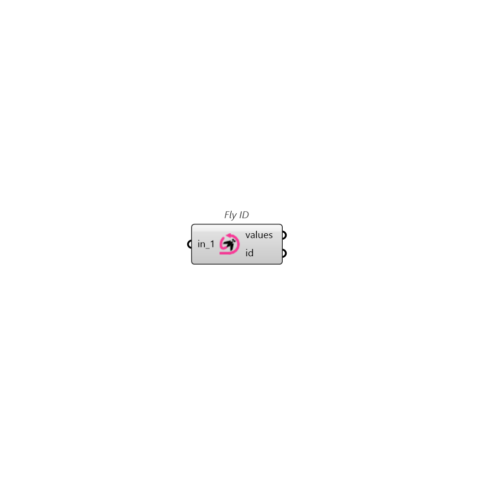

##  Fly ID

Generates iteration ID from a collection of sliders, panels, or valueLists.

### Inputs

* #### in_1 []

  Please connect a Slider, Panel, or ValueList, as a valid input

### Outputs

* #### values

  List of input values

* #### id

  A unique ID created based on the input values. Connect this output to Pollination Fly's id input.
