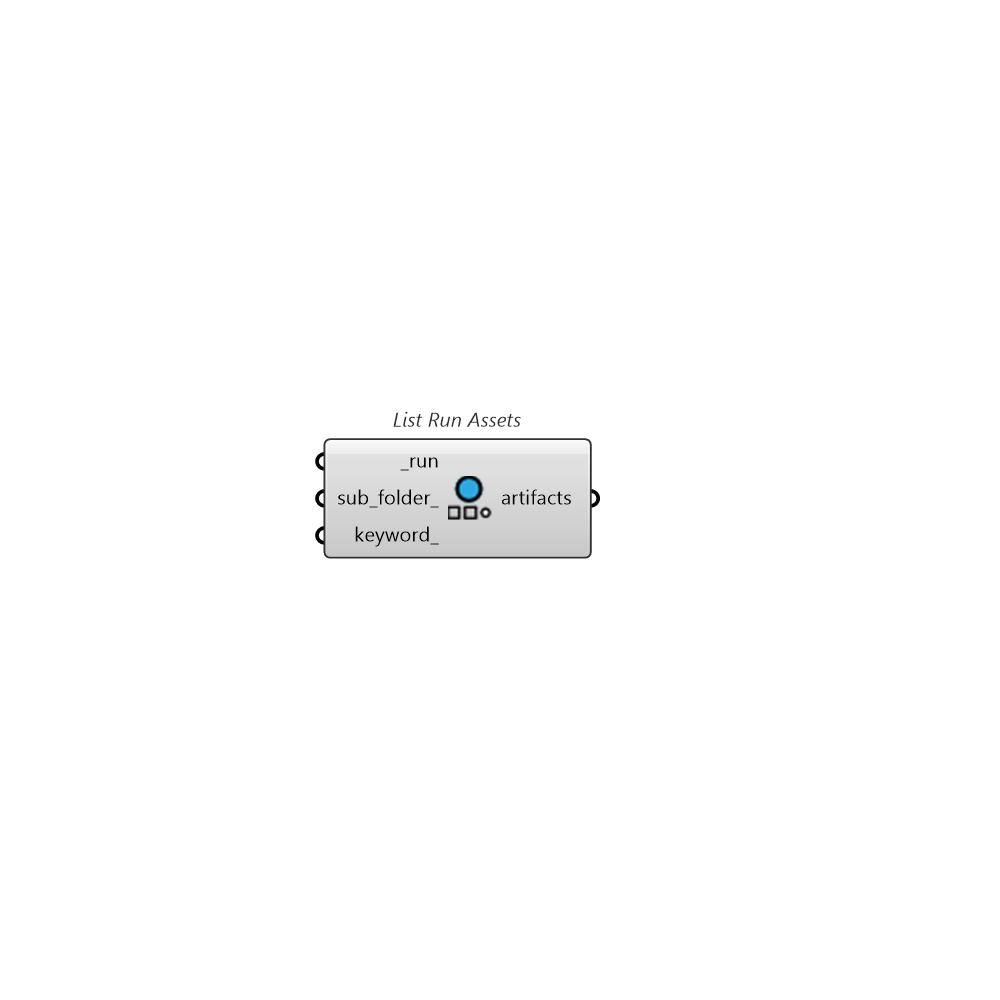

##  List Run Assets

List all available cloud assets from a finished run of a project

### Inputs

* #### run [Required]

  A finished run of a cloud study from which artifacts will be listing. Use CheckStudyStatus component to get a finished run

* #### sub_folder [Optional]

  An optional input for relative folder path where you want to list all Pollination job's files, instead of project root folder.  For example: "Phase 1/Team A"

* #### keyword [Optional]

  A keyword to filter the files.

### Outputs

* #### artifacts

  Run assets to be downloaded by LoadAssets.
