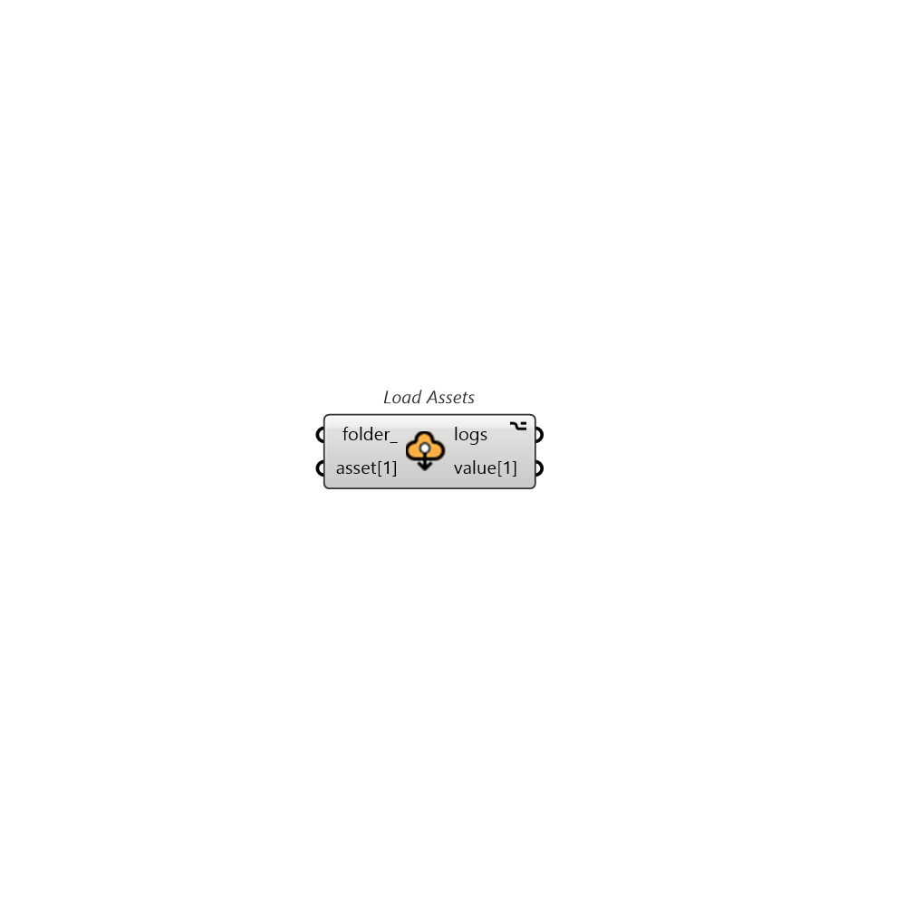

##  Load Assets

Download cloud based assets or load locally saved assets

### Inputs

* #### folder [Optional]

  The directory path to save the Pollination run's results.

* #### asset[1] []

  A Pollination run's asset to load. One asset per input.

### Outputs

* #### logs

  ...

* #### value[1]

  Loaded asset from asset[1]
