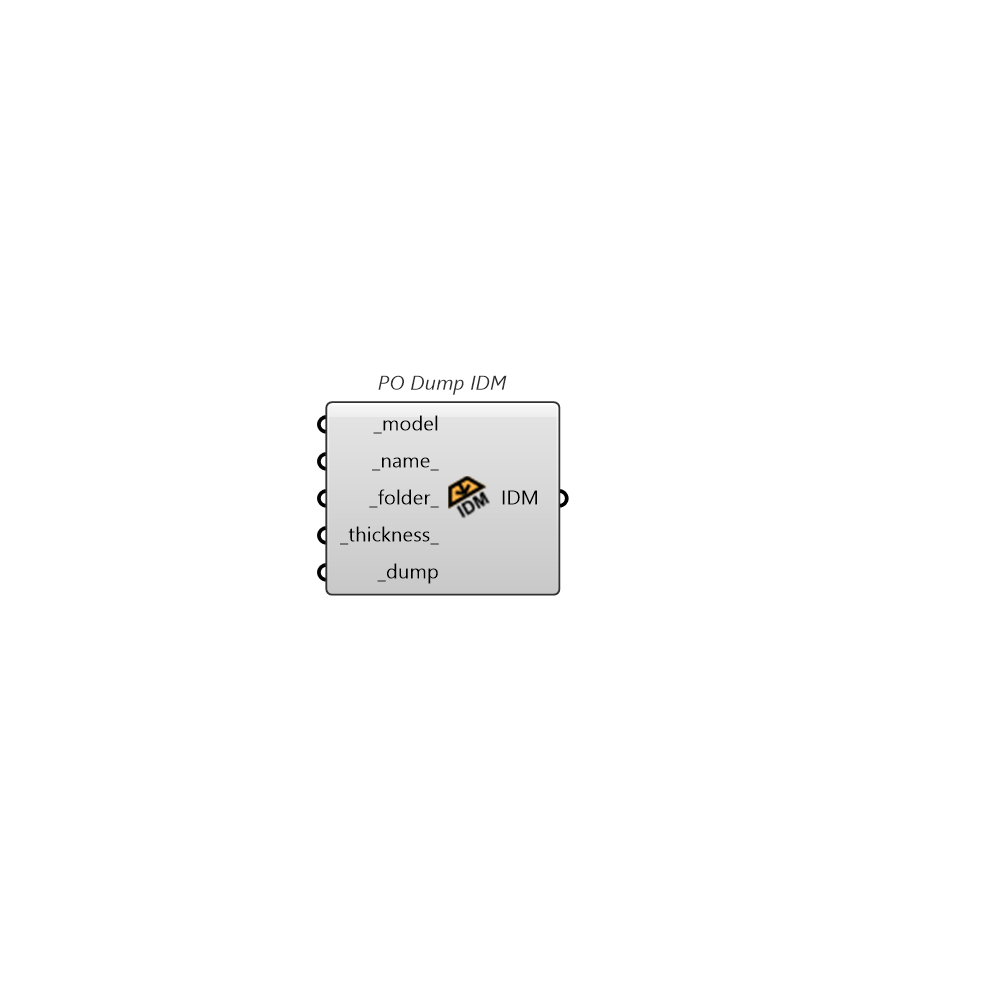

##  PO Dump IDM

Save entire model as IDM file

### Inputs

* #### model [Required]

  A Honeybee Model object to be written to a IDM file.

* #### name [Default]

  A name for the file to which the honeybee objects will be written. If unspecified, it will be derived from the model identifier.

* #### folder [Default]

  An optional directory into which the honeybee objects will be written. The default is set to the default simulation folder.

* #### thickness [Default]

  Maximum wall thickness for internal walls

* #### dump [Required]

  Set to "True" to save the honeybee model to a IDM file.

### Outputs

* #### IDM

  The location of the file where the IDM file is saved.
