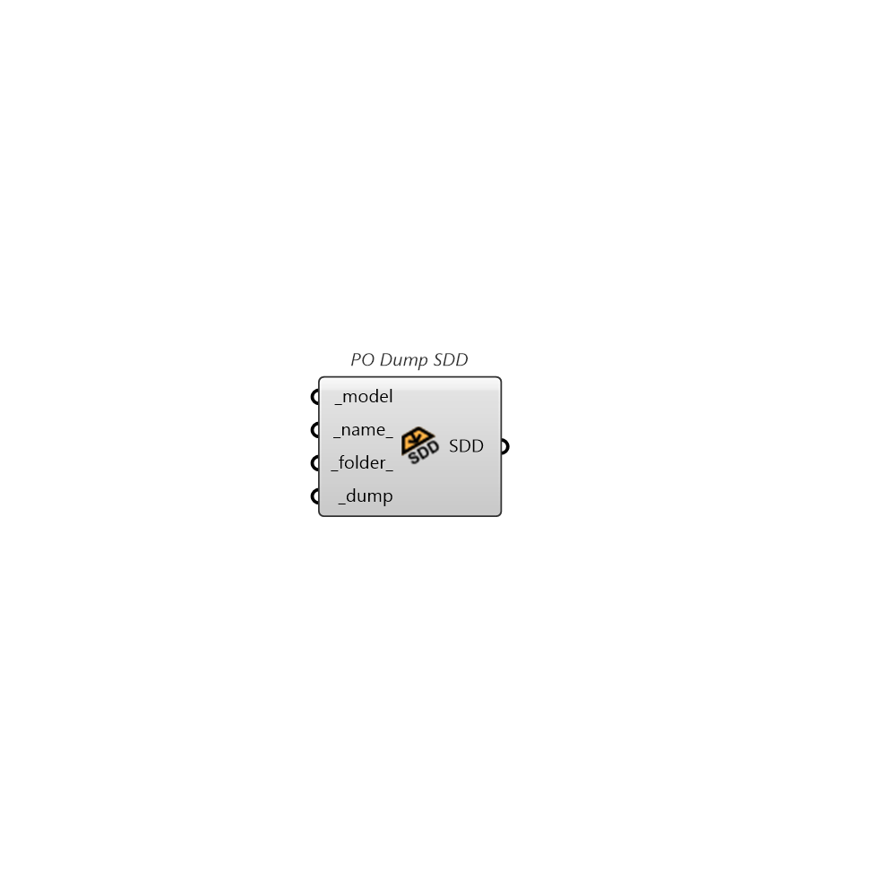

##  PO Dump SDD

Save entire model as CBECC Standards Data Dictionary (SDD) XML file

### Inputs

* #### model [Required]

  A Honeybee Model object to be written to a SDD XML file.

* #### name [Default]

  A name for the file to which the honeybee objects will be written. If unspecified, it will be derived from the model identifier.

* #### folder [Default]

  An optional directory into which the honeybee objects will be written. The default is set to the default simulation folder.

* #### dump [Required]

  Set to "True" to save the honeybee model to a SDD XML file.

### Outputs

* #### SDD

  The location of the file where the SDD XML file is saved.
