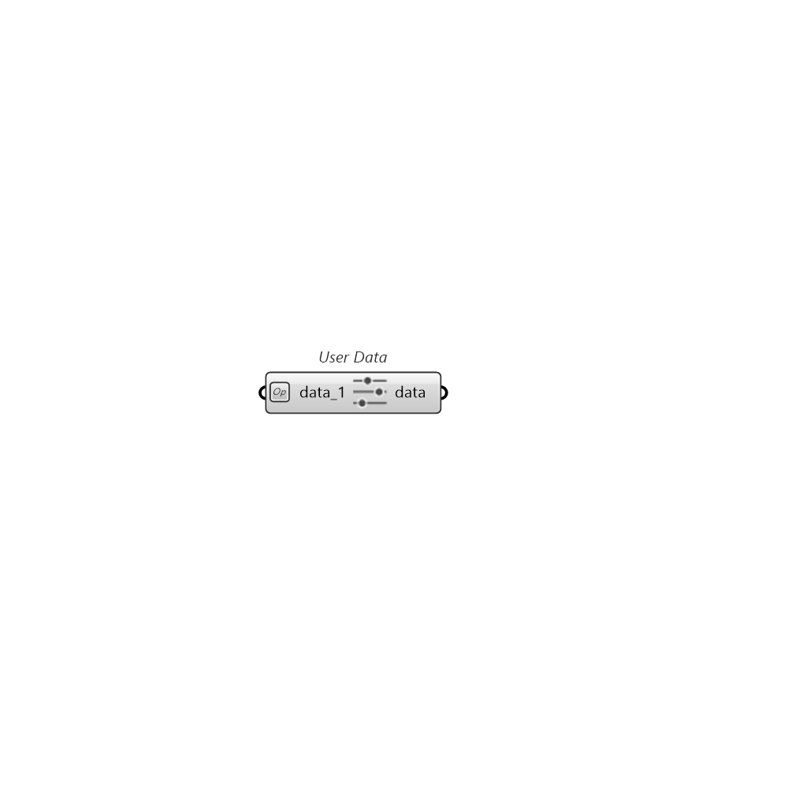

##  User Data

Collects user's inputs as meta data for each run. Right click on the input to change the name. You can zoom in to add more inputs to the component or remove extra inputs. Once your component is ready connect the output of this component to SetupRuns to attach meta data to each run. You can also use this component to collect the data and connect the output to Fly's data input.You can use these inputs later to explore the runs and filter them.

### Inputs

* #### data_1 []

  An user's input for extra meta data for a Pollination study. It can also to be recorded for the Pollination Fly's iterations. One or a list of values is acceptable, but each grip is limited with 10 values max. Null or Empty value will be marked as "NoData"(-999).

### Outputs

* #### data

  Extra user's data for Pollination run or Pollination Fly's data input
