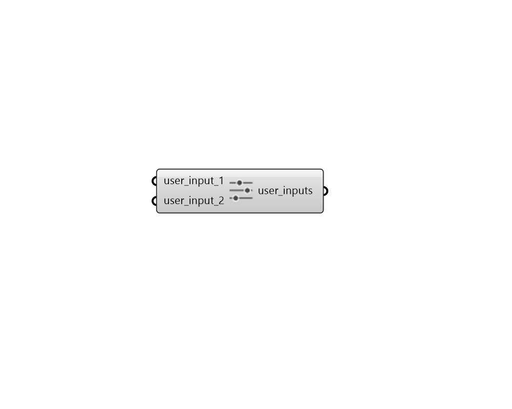

# User Inputs

User inputs as metadata for each run. Right click on the input to change the name. You can zoom in to add more inputs to the component or remove extra inputs. Once your component is ready connect the output of this component to Setup Runs component to add these inputs to each run. You can use these inputs later to explore the runs and filter them.

## Inputs

* **user\_input\_1**

  An user's input for extra meta data of a Pollination run. 

* **user\_input\_2**

  An user's input for extra meta data of a Pollination run. 

## Outputs

* **user\_inputs**

  Extra user's inputs for Pollination run 

