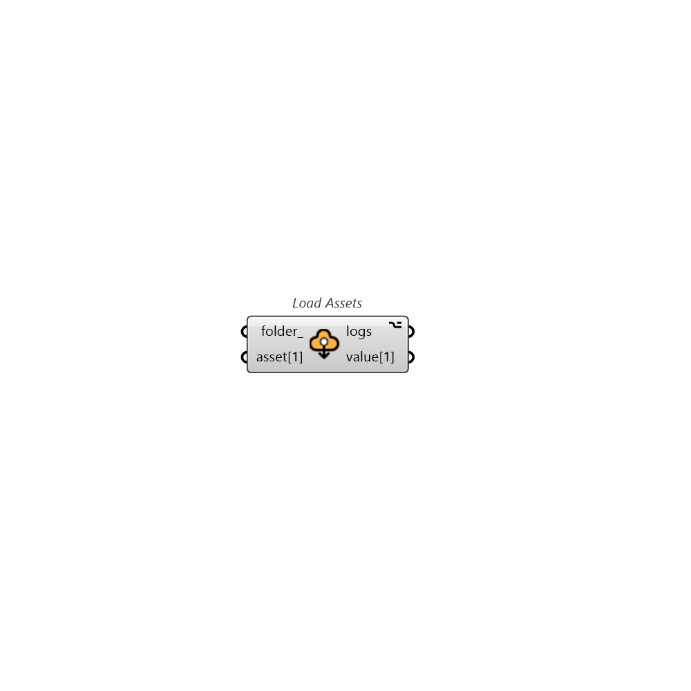

## Load Assets

Description 

#### Inputs
* ##### folder 
The directory path to save the Pollination run's results. 
* ##### asset[1] 
A Pollination run's asset to load. One asset per input. 

#### Outputs
* ##### logs
... 
* ##### value[1]
Loaded asset from asset[1] 