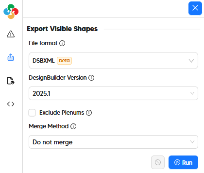
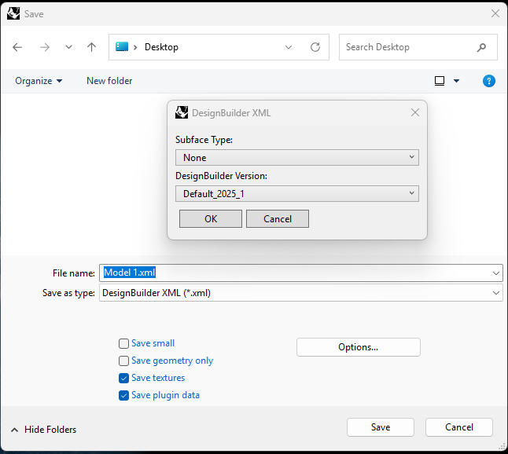

# Export to DesignBuilder (dsbXML)

While the native .dsb file format used by DesignBuilder is proprietary and not a format that the Pollination plugins can author, the DesignBuilder team spent a good fraction of the early 2020's building a new XML file type for import/export, which exposes the full parameter set of the DesignBuilder application in a manner that third party software like Pollination can use. Entitled dsbXML (short for “DesignBuilder XML”), the file format gives full control to specify all properties of the DesignBuilder model and allows for a 100% faithful translation of geometry from Pollination to DesignBuilder. At the the moment, Pollination exporters for dsbXML are focused on translation of geometry and boundary conditions but the translation of other attributes is a work in progress (WIP) and will likely be supported in the future.

| Model Element                   | DesignBuilder   |
| ------------------------------- | --------------- |
| Geometry                        | ✅              |
| Zoning                          | ✅ 1 |
| Face Types (eg. AirBoundary) | ✅              |
| Boundary Conditions             | ✅              |
| Opaque Constructions            | :x:             |
| Window Constructions            | :x:             |
| Schedules                       | :x:             |
| Internal Loads                  | :x:             |
| Thermostats + Outdoor Air    | :x:             |
| Program Types                   | :x:             |
| HVAC Systems                    | :x:             |
| SHW Systems                     | :x:             |

1 Supported via an export option that merges rooms of the same zone (or shared plenums) into a single volume.

## In the Pollination Revit Plugin (Model Editor)

Exporting a dsbXML file from the Pollination Model Editor just involves going to the "Export" tab on the left side of the window and selecting "DesignBuilder Model (.xml)" as the file format.

The dsbXML exporter has an extra option to select the version of DesignBuilder that you are exporting to (with both the 7.3 stable release and the latest development 2025.1 version of DesignBuilder supported). Using the new export option and importing the dsbXML is fairly straightforward once you have done it the first time as this video demonstrates:


How to export a Pollination model to DesignBuilder in the Model Editor


# In the Pollination Rhino Plugin

Exporting a dsbXML file from the Pollination Rhino plugin just involves the "File > Save As" menu and then selecting "DesignBuilder XML (*.xml)" as the file type.

The dsbXML exporter has an extra option to select the version of DesignBuilder that you are exporting to (with both the 7.3 stable release and the latest development 2025.1 version of DesignBuilder supported). There is also an option to select a "Subface Type", which can be used to translate certain types of Honeybee Doors to DesignBuilder Sub-Surfaces during export. This enables people to set up DesignBuilder models with  Sub-Surfaces in a way that does not require them to split walls/roofs/floors in the traditional manner that this is done

The following video demonstrates how the new "Save As dsbXML" feature can be used to get Sub-Surfaces in DesignBuilder, which can be used for modeling radiant heating/cooling as well as complex facade cases like spandrel panels:


How to export a Pollination model to DesignBuilder in the Rhino Plugin

