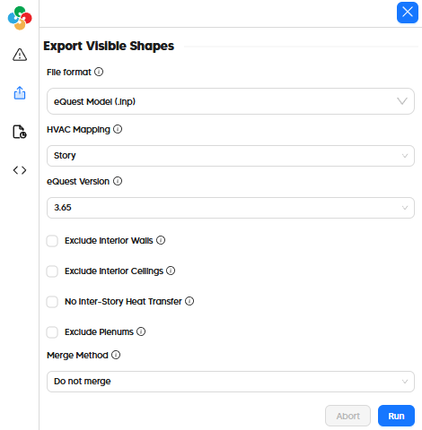

# Export to eQuest (INP)

Due to the well-documented, text-readable INP file format used by eQuest, nearly all attributes can be transferred through the export.

| Model Element                   | eQuest          |
| ------------------------------- | --------------- |
| Geometry                        | ✅              |
| Zoning                          | ✅ 1 |
| Face Types (eg. AirBoundary) | ✅              |
| Boundary Conditions             | ✅              |
| Opaque Constructions            | ✅              |
| Window Constructions            | ✅              |
| Schedules                       | ✅              |
| Internal Loads                  | ✅              |
| Thermostats + Outdoor Air    | ✅              |
| Program Types                   | ✅ 2 |
| HVAC Systems                    | ✅ 3 |
| SHW Systems                     | :x:             |

1 Supported via an export option that merges rooms of the same zone into a single volume.\
2 Translated to switch statements for easy editing of all zones with the same program.\
3 Only HVAC grouping is translated and not any HVAC attributes.

## In the Pollination Revit Plugin (Model Editor)

Exporting an eQuest INP file from the Pollination Model Editor just involves going to the "Export" tab on the left side of the window and selecting "eQuest Model (.inp)" as the file format.

# In the Pollination Rhino Plugin

Exporting an INP from the Pollination Rhino plugin just involves the "File > Save As" menu and then selecting "eQuest Geometry (*.inp)" as the file type as seen in this video:


How to export a Pollination model to eQuest INP

