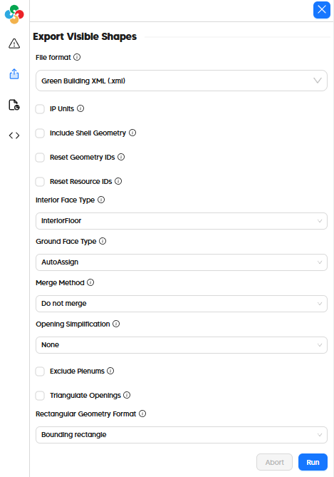

# Export to Green Building XML (gbXML)

## In the Pollination Revit Plugin (Model Editor)

Exporting a gbXML from the Pollination Model Editor just involves going to the "Export" tab on the left side of the window and selecting "Green Building XML (.xml)" as the file format. The exporter comes with a range of options to support the many different ways that gbXML files can be interpreted by destination simulation tools:

## In the Pollination Rhino Plugin

Exporting a gbXML from the Pollination Rhino plugin just involves the "File > Save As" menu and then selecting "Green Building XML (*.xml)" as the file type as seen in this video:


How to export a Pollination Rhino model to gbXML

