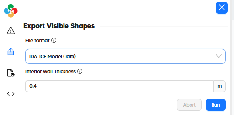

# Export to IDA ICE (IDM)

Thanks to the open nature of the IDM file format that IDA ICE uses, the Pollination plugins are able to author IDMs directly. At the the moment, Pollination exporters for IDM are focused on accurate translation of geometry and zoning but the translation of other energy simulation attributes may be supported in the future.

| Model Element                   | IDA ICE         |
| ------------------------------- | --------------- |
| Geometry                        | ✅ 1 |
| Zoning                          | ✅ 2 |
| Face Types (eg. AirBoundary) | :x:             |
| Boundary Conditions             | :x:             |
| Opaque Constructions            | :x:             |
| Window Constructions            | :x:             |
| Schedules                       | :x:             |
| Internal Loads                  | :x:             |
| Thermostats + Outdoor Air    | :x:             |
| Program Types                   | :x:             |
| HVAC Systems                    | :x:             |
| SHW Systems                     | :x:             |

1 Includes an auto-generated building body to set interior vs. exterior boundary conditions.\
2 Zones are exported as Groups in the IDM.

## In the Pollination Revit Plugin (Model Editor)

Exporting an IDM file from the Pollination Model Editor just involves going to the "Export" tab on the left side of the window and selecting "IDA-ICE Model (.idm)" as the file format.

# In the Pollination Rhino Plugin

Exporting an IDM from the Pollination Rhino plugin just involves the "File > Save As" menu and then selecting "IDA-ICE Model (*.idm)" as the file type as seen in this video:


How to export a Pollination model to IDA ICE

