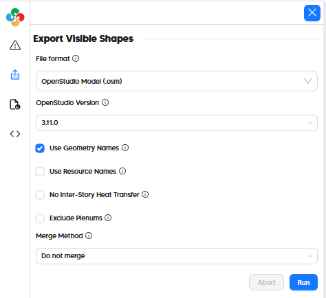

# Export to IES-VE (GEM)

## In the Pollination Revit Plugin (Model Editor)

Exporting an IES-VE GEM file from the Pollination Model Editor just involves going to the "Export" tab on the left side of the window and selecting "IE-SVE Geometry (.gem)" as the file format.

# In the Pollination Rhino Plugin

Exporting an OSM from the Pollination Rhino plugin just involves the "File > Save As" menu and then selecting "IES-VE Geometry (*.gem)" as the file type as seen in this video:


How to export a Pollination model to IES-VE


