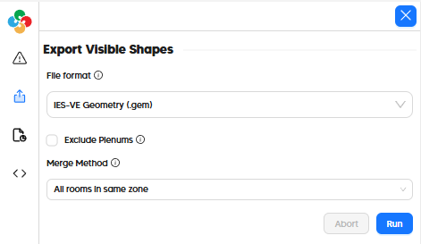

# Export to IES-VE (GEM)

Given the limitations of the GEM format, exporting Pollination models to IES-VE only transfers geometry and a few general properties. Transfer of other energy simulation properties (eg. Program Types) from Pollination to IES-VE is currently a work in progress (WIP).

| Model Element                   | IES-VE          |
| ------------------------------- | --------------- |
| Geometry                        | ☑              |
| Zoning                          | ☑ 1 |
| Face Types (eg. AirBoundary) | ☑              |
| Boundary Conditions             | :x:             |
| Opaque Constructions            | :x:             |
| Window Constructions            | :x:             |
| Schedules                       | :x:             |
| Internal Loads                  | :x:             |
| Thermostats + Outdoor Air    | :x:             |
| Program Types                   | ☑ 2 |
| HVAC Systems                    | :x:             |
| SHW Systems                     | :x:             |

1 Supported via an export option that merges rooms of the same zone (or shared plenums) into a single volume.\
2 Map-able to IES-VE Templates through the Pollination Bridge navigator (WIP).

## In the Pollination Revit Plugin (Model Editor)

Exporting an IES-VE GEM file from the Pollination Model Editor just involves going to the "Export" tab on the left side of the window and selecting "IE-SVE Geometry (.gem)" as the file format.

# In the Pollination Rhino Plugin

Exporting a GEM from the Pollination Rhino plugin just involves the "File > Save As" menu and then selecting "IES-VE Geometry (*.gem)" as the file type as seen in this video:


How to export a Pollination model to IES-VE

