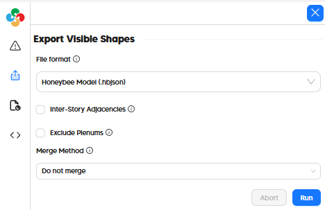
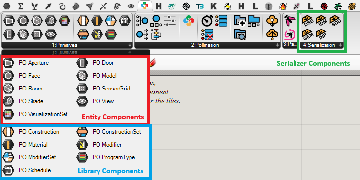

# Ladybug Tools Interoperability

There is no loss of data when transferring models between Pollination and Ladybug Tools. All features of the Pollination model are translated into the HBJSON or DFJSON format.

| Model Element                  | Ladybug Tools     |
| ------------------------------ | ----------------- |
| Geometry                       | ☑                |
| Zoning                         | ☑                |
| Face Types (eg. AirBoundary)| ☑                |
| Boundary Conditions            | ☑                |
| Opaque Constructions           | ☑                |
| Window Constructions           | ☑                |
| Schedules                      | ☑                |
| Internal Loads                 | ☑                |
| Thermostats + Outdoor Air   | ☑                |
| Program Types                  | ☑                |
| HVAC Systems                   | ☑                |
| SHW Systems                    | ☑                |

## In the Pollination Revit Plugin (Model Editor)

To use models in the Pollination Model Editor with Ladybug Tools for Grasshopper, simply save the model as a "Honeybee Model (.hbjson)". This can be loaded into Grasshopper via the [HB Load Objects](https://docs.ladybug.tools/honeybee-primer/components/3_serialize/load_objects) component.

HBJSONs can also be opened directly within the Pollination Rhino plugin for further cleanup and customization before use with Ladybug Tools.

Models passing Generic validation in the Model Editor will work well with all Ladybug Tools simulation features.

## In the Pollination Rhino Plugin (Export/Import DFJSON and HBJSON)

The Pollination Rhino plugin offers a "File > Save As" option for "Honeybee Model (*.hbjson)", which can be loaded into Grasshopper via the [HB Load Objects](https://docs.ladybug.tools/honeybee-primer/components/3_serialize/load_objects) component.

However a more seamless integration with Ladybug Tools is achievable via the Pollination Rhino Grasshopper Components.

## Pollination Rhino Grasshopper Components

In addition to interoperability offered by importing and exporting DFJSON and HBJSON, the Pollination Rhino Plugin includes several Grasshopper components to ensure these models can be used seamlessly with the Ladybug Tools Grasshopper plugin.

Of the available components, three types are particularly relevant to the interoperability between Pollination Rhino and Ladybug Tools:

* _Primitives entity components_ to translate Pollination Rhino entities (eg. Room) into Honeybee entities
* _Primitives library components_ to use Pollination UI from inside Grasshopper
* _Serializer components_ to serialize a Honeybee model in Grasshopper to other file formats.

## Primitives entity components

Primitive components are is similar to native Grasshopper params except they bring fully-detailed objects (eg. Room or Model) instead of .

Right click on it to access to menu of actions. Generally the available features are:

* **Synchronize**: It refreshes the data which the component is reading.&#x20;
* **Select**: It selects the objects from Rhino canvas&#x20;
* **Bake**: It bakes Honeybee objects or Pollination Rhino objects&#x20;
* **Internalise**: It saves in persistent memory the data&#x20;
* **Clear**: It clear the persistent memory

### Sample of Pollination Rhino to Honeybee Grasshopper objects

Use one of the entity components, for example _Pollination Room _and right click on it.

.png>)

Click on _Select Pollination Rooms _to select the rooms you want from Rhino canvas. It converts every Pollination Rhino room to a Honeybee room.

.png>)

Continue the workflow with Honeybee. For example, I can add border shades to all apertures. Use one of the preview components of Honeybee to check the geometries.

.png>)

At this point you can decide to continue with Honeybee or going back to Rhino using the Bake feature.

