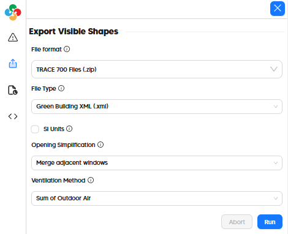

# Export to TRACE 700 (gbXML, XLSX, and EXP)

While the native TRACE 700 .TRC file type is proprietary and not a format that the Pollination plugins can author, TRACE 700 has a fairly robust importer for gbXML and also supports an importer for its own .EXP file type, which Pollination can author to transfer programs to TRACE 700 as room templates. Combined with an XLSX that Pollination exports, which includes values to paste into the TRACE 700 component tables, virtually all attributes of even the largest Pollination models can be transferred to TRACE 700 in a matter of minutes.

| Model Element                  | TRACE 700         |
| ------------------------------ | ----------------- |
| Geometry                       | ☑                |
| Zoning                         | ☑                |
| Face Types (eg. AirBoundary)| ☑                |
| Boundary Conditions            | ☑                |
| Opaque Constructions           | ☑                |
| Window Constructions           | ☑                |
| Schedules                      | ☑                |
| Internal Loads                 | ☑                |
| Thermostats + Outdoor Air   | ☑                |
| Program Types                  | ☑ 1   |
| HVAC Systems                   | :x:               |
| SHW Systems                    | N/A               |

1 Exported as Room templates through the TRACE 700 EXP file format.

## In the Pollination Revit Plugin (Model Editor)

Exporting an Pollination Model to TRACE 700 technically only requires the export of a gbXML, which is formatted for compatibility with TRACE 700. This can be done by going to the "Export" tab on the left side of the window and selecting "TRACE 700 Files (.zip)" as the file format with "Green Building XML (.xml)" as the "File Type." Importing the resulting gbXML into TRACE 700 will transfer all geometry, zoning, and boundary conditions to TRACE 700.

To export the other energy properties from Pollination to TRACE 700, the EXP and XLSX files can be used. A full overview of how to use these different file types is summarized in the following videos.

#### Intro to Pollination TRACE 700 Workflows


Intro to Pollination TRACE 700 Workflows


#### Workflows 1 & 2 - Importing Geometry and Zoning with gbXML


Workflows 1 & 2 - Importing Geometry and Zoning with gbXML


#### Workflow 3 - Importing Loads and Construction Templates with EXP


Workflow 3 - Importing Loads and Construction Templates with EXP


#### Workflow 4 - Overriding Template Properties with XLSX


Workflow 4 - Overriding Template Properties with XLSX


#### Finale - Detailed Airflow Calculations and Simulate!


Finale - Detailed Airflow Calculations and Simulate!


## In the Pollination Rhino Plugin

Trace 700 export will be coming soon to the Pollination Rhino plugin.
