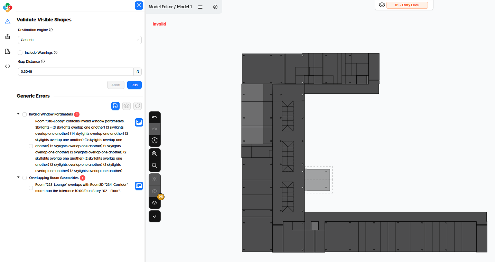
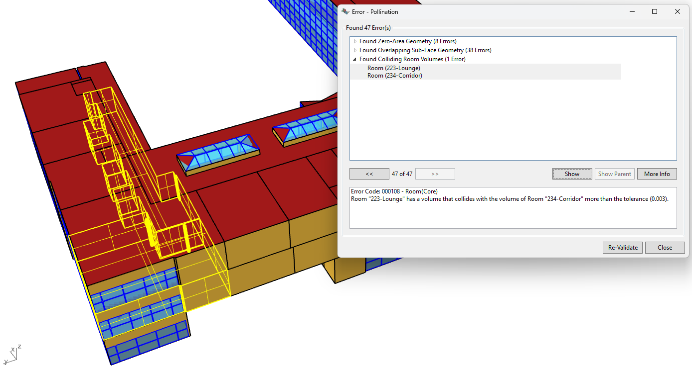

# Validation

Our pact with you is simple. Every valid Pollination model should export and import to the corresponding simulation tool with no errors.

At the heart of this interoperability guarantee is a concept called model validation. All Pollination plugins come equipped with a validation routine, which runs a number of tests on the model to yield a list of issues to be fixed within Pollination software before export (turning the model from invalid to valid). If validation issues are not addressed before export, they can cause problems or errors in the destination software. Each type of validation issue has its own [Error Code](validation-error-codes.md) and corresponds with a set of possible commands that can be run in the Pollination plugin to fix the problem in different ways.

## What Validation Is And Is Not

Validation is meant to be a comprehensive check of all things that could make a model un-simulate-able or import with errors in a destination simulation tool. This includes general geometry checks like compliance with [the 5 golden rules of Pollination model geometry](https://github.com/ladybug-tools/honeybee-schema/wiki/2.1-Face3D-Schema#the-5-golden-rules-of-honeybee-schema-geometry) as well as engine-specific checks like adjacent constructions being in reverse order of materials for EnergyPlus simulation.

While a valid model can be simulated in simulation engines, it is always the modeler's responsibility to ensure that the assumptions of the valid model align with the real building design. In other words, a valid model does not guarantee reasonable or accurate simulation results. Just that the model will import to the destination software without errors or warnings and that the exported model will be as faithful translation of the geometry as possible into that destination tool.

## Example

Two room volumes colliding or overlapping with one another will often result in erroneous solar calculations in simulation tools. Validation routines within the Pollination plugins identify these cases and offer a range of ways to fix the problem (eg. subtract one room volume from the other, draw a line down the middle of the overlap and align the two rooms to it, etc.). By using the Pollination validation routine and corresponding fixing commands, virtually any Revit or Rhino model can be made into a valid simulation model in a fraction of the time it would take to redraw geometry within the destination simulation tool.

------

# How to Validate for Different Plugins

## Validating in the Pollination Revit Plugin (Model Editor)

In the Model Editor of the Pollination Revit Plugin, validation is performed in its own dedicated tab on the left side of the interface. Just selecting the "Destination engine" and hitting "Run" will bing up a list of issues to resolve in the model (if any exist).

## Validating in the Pollination Rhino Plugin

Validation within the Pollination Rhino plugin is performed by running the [po\_validatemodel.md](../rhino-plugin/pollination-commands/po_validatemodel.md "mention") command. The command has an option to select a "Destination", which refers to the simulation tool to which the model will be exported. Running the command will bring up a window where each individual error can be highlighted and you can zoom into each problematic geometry so that it can be fixed.

Additionally, whenever you open or import a HBJSON or DFJSON in the Pollination Rhino plugin, you will also be asked if you want to validate the model upon import so that you are aware of any issues with the model before working with it.

## Validating in Ladybug Tools for Grasshopper

Validation can also be performed within the Grasshopper visual scripting interface of Rhino by plugging a Honeybee Model into the [HB Validate Model](https://docs.ladybug.tools/honeybee-primer/components/3_serialize/validate_model) component of Ladybug Tools. This component runs the same set of checks that the po\_validatemodel.md](../rhino-plugin/pollination-commands/po_validatemodel.md "mention") command runs in the Pollination Rhino plugin. However, validation errors are only returned as a list of text, making it much harder to visualize and fix them compared to using the Pollination Rhino plugin's command.

## Validating from Command Line

Lastly, validation can also be run on a `.hbjson` or `.dfjson` file from the command line by installing [lbt-dragonfly](https://pypi.org/project/lbt-dragonfly/) and then running the [`honeybee validate model`](https://www.ladybug.tools/honeybee-core/docs/cli/validate.html) command for a HBJSON or the [`dragonfly validate model`](https://www.ladybug.tools/dragonfly-core/docs/cli/validate.html) command for a DFJSON. Note that you may also need to install specific honeybee or dragonfly extensions to be able to validate for a specific destination engine.
