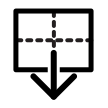

# Room Commands

Below are all commands that operate on rooms.

##  Align

Align the selected rooms' vertices to the selected lines/polylines if the room vertices lie within the specified Alignment Distance.

Options

**Distance**

  The maximum distance between a room vertex and the line or polyline at which point the vertex will be aligned to the line

**Snap Vertices**

  Select to snap the room vertices to the line/polyline vertices after the initial alignment operation is complete

**Constrain Edges**

  Select to have all axes of the room edges that were not pulled to the line geometry be preserved

Using the `Snap Vertices` option will perform an additional operation that snaps the vertices to line/polyline vertices after the initial alignment operation is complete.



This command is primarily used for fixing misalignments between rooms, which are common in raw exports from Revit. It is also useful for adjusting the exterior boundary around entire stories, enabling you to align rooms to the inside or outside wall finish instead of using the wall centerline as is typical when exporting Revit rooms. See the Create Boundary command for more information.



This command is only visible when at least one room and one alignment line/polyline are selected.

---

##  Auto align

Automatically align selected rooms to common axes identified across them. The command is intended to automatically perform most of the alignments that would typically be done manually. Note that having a line selected while running this command will force the generated alignment axes to be generated only in the plane of that line.

Options

**Distance**

  The distance with which room vertices will be aligned to common axes. No vertex in the input rooms will be moved more than this distance

**Exclude Angle**

  A positive number in degrees for the maximum difference that a geometry segment can differ from the alignment axes for it to be ignored/excluded from alignment

**Story-by-Story**

  Select to have this command run with each story individually rather than all stories of the model together. Running story-by-story tends to produce a more controlled and result with fewer unintended alignments happening. This is useful when the model is large and rooms between stories do not have a strong relation to one another.

**Axes Only**

  Select to have this command only output the common axes of the selected rooms into the scene and not perform any auto-alignment of rooms with these axes. This can give more control over which axes are or are not used by allowing manual selection and aligning with desired axes

---

##  Join coplanar faces

Join coplanar walls of the room, effectively removing colinear vertices from the room polygon. Use this command to simplify the geometry and clean up the model before running 'solve adjacency' or 'alignment' commands.


Join Coplanar Faces


---

##  Pull to room

Pull the vertices of one or more rooms to the first 'target' room in the selection. The operation of pulling can be thought of as aligning the rooms to the target room's segments and then snapping to its vertices.

Options

**Pull Distance**

  The maximum distance between a room vertex and the target room edges at which point the vertex will be pulled to the target room

**Coordinate Vertices**

  Select to further coordinate the vertices after the initial pulling operation is complete. Coordination means that any vertices of the target room that lie within the specified distance to a pulled room but were NOT matched to a vertex on that room will be inserted into the pulled room

**Constrain Edges**

  Select to have all axes of the room edges that were not pulled to the adjacent room be preserved

**Invert Selection**

  Select to have the command pull the first room in the selection to all other rooms in the selection. This is the inverse of the default behavior, which uses the first room in the selection as a target and then pulls all following rooms to it

Using the `Coordinate Vertices` option will run an additional operation to adjust the number of vertices in the rooms that were pulled. This can result in better matching of segments between the rooms like so:






pull to room multi segment lines


---

##  Remove holes

Remove the holes inside the room that are smaller than a certain specified Area Threshold. Use this command to remove column and duct holes from inside rooms.

Options

**Area Threshold**

  The maximum area for a hole below which it will be removed


Remove holes


---

##  Remove short segments

Remove the segments of the room polygon that are smaller than a certain specified Segment Distance. Use this command to remove column holes and other unwanted small segments at the edges of the rooms.

Options

**Segment Distance**

  The maximum length of a segment below which it will be removed


Remove Columns at the Edge


---

##  Simplify Curved Edges

Simplify and reduce the number of vertices defining curved edges of rooms.

Options

**Deviation Distance**

  The distance that a curved part of the room is allowed to differ from a straight line. Lower tolerance values correspond to a higher resolution of curvature with more vertices

---

##  Snap to grid

Snap the selected rooms to a cartesian grid defined by a Grid Increment distance, which sets the resolution of the grid. This command is useful for IES VE modelers who need geometry on a grid for ease of edit-ability.

Options

**Grid Increment**

  A positive number for dimension of each grid cell. This should be less than the smallest detail to resolve on the rooms. NOTE that this value can be different from the grid size in the preview

**Exclude Angle**

  A positive number in degrees for the maximum difference that a geometry segment can differ from the grid for it to be ignored/excluded from snapping. Setting the exclude angle to zero will guarantee that all geometry is snapped to the grid. However, this may produce jagged geometries, particularly when there are parts of a geometry that are not intended to be aligned with a grid


Snap to Grid


---

##  Subtract rooms

Subtract one room from another room. Useful for resolving colliding room geometries.

The first room of the selection is the room to be subtracted from and all following rooms in the selection will be used for subtraction.

---

##  Export windows

Export windows and doors to HBJSON. Use this file to edit the geometry in Pollination Rhino plugin. You can then use the import windows button to import the edited windows back to Model Editor.

---

##  Import windows

Import windows from a HBJSON file.

Options

**Projection Distance**

  The distance used to project the window/door geometry onto parent rooms. Set to zero to have windows/doors only be added if they are coplanar with a room wall or roof.

**Is Revit Sourced**

  Select if the HBJSON file with windows has been exported directly from the Revit model. If so, the window geometry will be synchronized with the model's units and coordinate system if they have changed from the original Revit model.

---

##  Offset windows

Offset all windows and/or skylights by a certain distance. This is useful for translating between interfaces that expect the window frame to be included within or excluded from the geometry.

Options

**Offset Distance**

  Offset all windows and/or skylights by a certain distance. This is useful for translating between interfaces that expect the window frame to be included within or excluded from the geometry

**Ignore Windows**

  Select to have the windows left as they are during the offset operation

**Ignore Skylights**

  Select to have the skylights left as they are during the offset operation

---

##  Repair windows

Fix the windows of the rooms by merging the colliding windows and trimming those that extend past the parent Face. The Rectangle option can be used to further simplify non-rectangular windows into rectangular shapes

Options

**Parent Edge Offset**

  A number for the distance from the parent face edges to which windows will be trimmed. Entering a non-zero number here can ensure that space is left on parent faces to account for window frames

**Small Area Threshold**

  The maximum area of a window below which it will be removed. Set to zero to keep all windows no matter their size or their validity.

**Rectangle**

  Select to have overlapping window geometries resolved by replacing them with a boundary rectangle around the overlapped group instead of boolean unioning the overlapped geometries. Useful in cases where a dozen or more geometries overlap with one another such that the unioned result is not as clean or desirable as a bounding rectangle

This command is intended to fix such issues while being faithful to the original window geometry. It trims windows that extend past their parent face and merges overlapping windows by either boolean-unioning them or replacing them with a rectangle around the group (if the `Rectangle` option is selected).

For intentionally simplifying the window geometry for either simulation speed or overall model cleanliness, see the "Simplify windows" command.

---

##  Simplify windows

Simplify the windows and skylights of a room for either simulation speed or overall model cleanliness.

Options

**Merge Distance**

  The maximum distance between rooms at which point they will be merged together. Setting a non-zero value here will allow you to merge rooms that have gaps in between them (crossing gaps up to the specified distance). This option is particularly useful for IDA-ICE users who must work with rooms that are exported at the interior wall finish

**Single Window**

  Select to have the windows simplified to a single window within the center of each wall, which matches the overall area of the original windows

**Delete Interior**

  Select to have the interior windows removed from the rooms, which can increase simulation speed in several BEM platforms

**Ignore Skylights**

  Select to have the windows left exactly as they are during the process of simplifying skylights

**Ignore Windows**

  A boolean to note if the windows should be ignored during the process of simplifying the windows

Note that this command is not intended to fix invalid or un-simulate-able windows and the "Repair windows" command should be used for these purposes.

---

##  Fill holes

Fill holes and gaps across the selected rooms with new rooms (or existing rooms that are adjacent to each hole).

Options

**Area Threshold**

  The area below which a hole gets merged into adjacent rooms and above which it will be filled with a new room. To fill all holes with new rooms, set the area threshold to zero. To have all holes merged into neighboring rooms, set the area threshold to a high number

**New Room Name**

  Text to set the name of newly-generated rooms. In the case of multiple holes being filled, this input will be a base name and an integer will be automatically added to the end of each new room name

---

##  Merge Small Rooms

Merge small rooms in the selection into the larger adjacent rooms. Small rooms are always merged into the adjacent large room with which they share the most perimeter.

Options

**Area Threshold**

  The floor area below which rooms are considered small and should be merged into larger rooms of the selection.

---

##  Merge rooms

Merge several rooms into a single room. Setting a Merge Distance that is larger than 0 will allow you to merge rooms that have gaps in between them - crossing gaps up to the specified distance.

Options

**Merge Distance**

  The maximum distance between the rooms in which the rooms should be merged.

**Simplify Windows**

  Select to have the windows simplified when merging rooms.

**Join Faces**

  Select to have the coplanar walls should joined together when merging rooms.

Useful for cases where multiple rooms in a Revit model should be represented as a single zone in the energy model.



---

##  Split

Split rooms or roofs by the selected lines/polylines.

---

##  Split core and perimeter

Create core and perimeter rooms for a selected room. This is particularly useful for creating models according to typical zoning practices, where each façade orientation is a separate zone.

Options

**Offset Distance**

  The distance that the perimeter of the rooms will be offset

**Air Boundary**

  Select to have the new separation walls between the core and perimeter rooms set to Air Boundary

The perimeter rooms will have a depth equal to the specified `Offset Distance` and the `Air Boundary` option lets you optionally set the boundaries between the core and perimeter rooms to an air boundary if the room being split represents an open space. It is recommended that the "Join coplanar faces" command be run before using this command.


Split core and perimeter


---

##  Vertically split

Split the selected rooms vertically if they are tall enough to cross multiple stories in the model.

---

##  Set air boundaries

Set the adjacencies between the selected rooms to use air boundaries. Note that adjacencies should be solved between rooms before running this method in order for it to have any effect. If lines are selected while running this command, they will be used to set air boundaries for only the adjacencies that are coincident with those lines.

---

##  Solve adjacency

Solve adjacency between selected rooms by assigning interior boundary conditions where rooms touch one another.

Options

**Ceiling Adjacencies**

  Select to have the adjacency between the stories solved

You can optionally turn off the `Ceiling Adjacency` if you are planing to export to a platform with it's own adjacency-solving routine (eg. IES-VE) or you are primarily interested in simulating each Story as a distinct unit with adiabatic floors and ceilings. This command will only be visible when more than one room is selected.

---

##  Create boundary

Create polyline boundaries around a selection of rooms. The command can return polylines for either the exterior border around the rooms or just the holes (or both).

Options

**Mode**

  The calculation mode for creating boundaries. The options are Include Holes, Exclude Holes , and Holes Only

**Merge Distance**

  The maximum distance between rooms below which the boundary will be drawn around the rooms together (instead of being separate for each room). Setting a non-zero value here will allow you to draw boundaries around rooms that have gaps in between them (crossing gaps up to the specified distance)

You can use the generated borders for aligning the existing rooms or creating new rooms. See the line commands for the full list of the available commands.


Create Boundary


---

##  Generate alignment axes

Generate suggested alignment axes for rooms using a selected line to specify the alignment direction. All generated axes will be parallel to the selected line and will fall along the common axes of the selected rooms.

Options

**Distance**

  The distance with which room vertices will be aligned to common axes. This dictates the resolution with which common axes will be generated

**All Common Axes**

  Select to have this command output all common axes of the rooms regardless of whether the rooms are already aligned to the axes. By default, only common axes to which the rooms are not already aligned are output

---

##  3D preview

Show the selected rooms and shades in 3D. The preview shows up in a new floating window.

Options

**Ceiling Adjacencies**

  Select to have the adjacency between the stories solved

**Exclude Plenums**

  Select to have ceiling and floor plenum depths ignored. This results in each room in the table translating to a single room in 3D instead of a base room with plenums split off of it


3D Preview


---

##  Find adjacency gaps

Identify gaps smaller than a specified gap distance. Such gaps typically do not make the model invalid or un-simulate-able but they can create cases where adjacency solving fails to set interior boundary conditions where they likely should be. Small gaps can also result in sliver geometries for floors/ceilings in the case the ceiling adjacencies are solved.

Options

**Gap Distance**

  The maximum distance between two rooms that is considered an unwanted adjacency gap. Differences between rooms that are higher than this distance are considered meaningful separations between rooms that should be preserved. Typical recommended values might be around 15 cm or 6''.

---

##  Validate model

Check whether the selected rooms are valid/simulate-able. Valid models should export to any of the supported BEM engines without errors. Invalid models will have their errors presented in a table with the option to select the part of the model where the error originates so that it can be fixed.

Options

**Destination Engine**

  The destination engine for which validation will be performed. Selecting an option here will ignore checks that are not relevant for the engine. Use the 'All' option to validate for all engines.


Validate Model


---