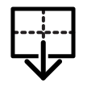
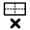
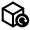

# Room Commands

Below are all commands that operate on rooms.

##  Align

Align the selected rooms' vertices to the selected lines/polylines if the room vertices lie within the specified Alignment Distance.

Options

**Distance**

  The maximum distance between a room vertex and the line or polyline at which point the vertex will be aligned to the line

**Snap Method**

  The method to be used for snapping room vertices to the lines. 'Snap Vertices' will snap the room vertices to the line/polyline vertices if they lie within the distance. 'Coordinate Vertices' will perform an additional step of inserting new room vertices when line/polyline vertices lie within the distance

**Constrain Edges**

  Select to have all axes of the room edges that were not pulled to the line geometry be preserved

---

##  Auto align

Automatically align selected rooms to common axes identified across them. The command is intended to automatically perform most of the alignments that would typically be done manually. Note that having a line selected while running this command will force the generated alignment axes to be generated only in the plane of that line.

Options

**Distance**

  The distance with which room vertices will be aligned to common axes. No vertex in the input rooms will be moved more than this distance

**Exclude Angle**

  A positive number in degrees for the maximum difference that a geometry segment can differ from the alignment axes for it to be ignored/excluded from alignment

**Axes Only**

  Select to have this command only output the common axes of the selected rooms into the scene and not perform any auto-alignment of rooms with these axes. This can give more control over which axes are or are not used by allowing manual selection and aligning with desired axes

**Use Anchor Lines**

  Select to have the currently selected line geometry override any suggested alignment axes. This can be used to ensure that auto-aligning does not move parts of the model that are already correct.

**Constrain Group Boundary**

  Select to have the boundary around the rooms set as anchor lines, ensuring that the outer edges of the group do not move during alignment and only cases within the room group are aligned

**Group by Base Plane**

  Select to have the command group the selected rooms by the underlying base plane that best fits the room geometry before auto-aligning them. This is useful in cases where the selected rooms contain different structural grids that are at angles to one another.

**Base Story Name**

  Optional text for the name of the level among the selected rooms to be used as a base for auto-aligning the other rooms in the selection. Rooms on this base story will not be edited during the alignment operation.

---

##  Auto block

Automatically group rooms into blocks using the most common orientation of right angles in the rooms.

Options

**Angle Increment**

  A positive number in degrees for the angle increment between blocks. This sets an upper limit on the number of blocks given that 45 divided by this increment yields the maximum number of categories the rooms can be grouped into

---

##  Auto zoning

Automatically assign zones to rooms with similar properties. Properties that are used to group rooms into zones include story, orientation, and (optionally) energy programs.

Options

**Orientation Count**

  A positive integer to set the number of orientation groups to use for zoning. Setting this to 4, for example, will result in zones being established based on the four orientations (North, East, South, West).

**North Angle**

  A number between 0 and 360 to set the clockwise north direction in degrees. (0=North, 90=East, 180=South, 270=West). Default is 0 for the world Y-axis. (North, East, South, West).

**Ignore Programs**

  Select to have any room programs ignored during the automatic zoning process in which case rooms with different programs may appear in the same zone.

---

##  Join coplanar faces

Join coplanar walls of the room, effectively removing colinear vertices from the room polygon. Use this command to simplify the geometry and clean up the model before running 'solve adjacency' or 'alignment' commands.

---

##  Match and replace rooms

Replace the room floor plate geometry of selected rooms using the rooms of a base story in the selection. This is useful for the case that several stories with repeated room geometry exist over the building all with unique room names and window geometry. However, only one story represents the clean room floor plates such that a desired result can be achieved by simply replacing the room geometry of the other stories with that of the base story.

Options

**Base Story Name**

  Text for the name of the level in the building that represents the clean room geometry to be used as a base for all of the stories to be replaced

**Overlap Percent**

  A number between that represents the percentage of total floor area overlap between a given base room and a room in the replaced stories at which point the room will be replaced with the geometry from the base story. It is recommended that 50% be used as the lowest and most lenient overlap here given that lower numbers have the potential to match a room to two or more rooms in the base story

**Projection Distance**

  A number to be used to project the original window and door geometry back onto the wall segments of each room after the floor geometry has been replaced. If the windows/doors on the original geometry do not differ by more than this distance between the base room and the replaced room, these original windows will be preserved

**Angle Tolerance**

  Angle tolerance in degrees, which sets the maximum angle difference between the normal vectors of a  window and wall at which point the window will be projected onto the wall and assigned to it

**Remove Unmatched**

  Select to have the rooms in the selection the that are not matched to any room on the base story removed from the model. This is useful when the clean up of the base story included deletion of several small rooms, which you want to be removed from the other stories during replacement

---

##  Pull to room

Pull the vertices of one or more rooms to the first 'target' room in the selection. The operation of pulling can be thought of as aligning the rooms to the target room's segments and then snapping to its vertices.

Options

**Pull Distance**

  The maximum distance between a room vertex and the target room edges at which point the vertex will be pulled to the target room

**Coordinate Vertices**

  Select to further coordinate the vertices after the initial pulling operation is complete. Coordination means that any vertices of the target room that lie within the specified distance to a pulled room but were NOT matched to a vertex on that room will be inserted into the pulled room

**Constrain Edges**

  Select to have all axes of the room edges that were not pulled to the adjacent room be preserved

**Invert Selection**

  Select to have the command pull the first room in the selection to all other rooms in the selection. This is the inverse of the default behavior, which uses the first room in the selection as a target and then pulls all following rooms to it

---

##  Remove holes

Remove the holes inside the room that are smaller than a certain specified Area Threshold. Use this command to remove column and duct holes from inside rooms.

Options

**Area Threshold**

  The maximum area for a hole below which it will be removed

---

##  Remove short segments

Remove the segments of the room polygon that are smaller than a certain specified Segment Distance. Use this command to remove column holes and other unwanted small segments at the edges of the rooms.

Options

**Segment Distance**

  The maximum length of a segment below which it will be removed

---

##  Simplify Curved Edges

Simplify and reduce the number of vertices defining curved edges of rooms.

Options

**Deviation Distance**

  The distance that a curved part of the room is allowed to differ from a straight line. Lower tolerance values correspond to a higher resolution of curvature with more vertices

---

##  Snap to grid

Snap the selected rooms to a cartesian grid defined by a Grid Increment distance, which sets the resolution of the grid. This command is useful for IES VE modelers who need geometry on a grid for ease of edit-ability.

Options

**Grid Increment**

  A positive number for dimension of each grid cell. This should be less than the smallest detail to resolve on the rooms. NOTE that this value can be different from the grid size in the preview

**Exclude Angle**

  A positive number in degrees for the maximum difference that a geometry segment can differ from the grid for it to be ignored/excluded from snapping. Setting the exclude angle to zero will guarantee that all geometry is snapped to the grid. However, this may produce jagged geometries, particularly when there are parts of a geometry that are not intended to be aligned with a grid

---

##  Subtract rooms

Subtract one room from another room. Useful for resolving colliding room geometries.

---

##  Export openings

Export windows and doors to HBJSON. Use this file to edit the geometry in Pollination Rhino plugin. You can then use the import windows button to import the edited windows back to Model Editor.

---

##  Import openings

Import windows and doors from a HBJSON file, replacing the currently-assigned windows. If rooms are selected while running this command, only the windows and doors of the selected rooms will be updated.

Options

**Projection Distance**

  The distance used to project the window/door geometry onto parent rooms. Set to zero to have windows/doors only be added if they are coplanar with a room wall or roof.

**Angle Tolerance**

  Angle tolerance in degrees, which sets the maximum angle difference between the normal vectors of the window and wall at which point the window will be projected onto the wall and assigned to it.

**Overwrite Existing**

  When enabled, existing windows and doors will be removed before adding the new ones from the file.

**Apply to selected rooms only**

  When enabled, windows will only be added to the rooms you have currently selected.

**Is Revit Sourced**

  Select if the HBJSON file with windows has been exported directly from the Revit model. If so, the window geometry will be synchronized with the model's units and coordinate system if they have changed from the original Revit model.

---

##  Make openings flush

Make the edges of nearby windows flush with one another. Useful for cleaning up overlapping windows in a way that does not merge them together like 'Repair Windows' or removing gaps between windows without offsetting all edges like 'Offset windows for frame'.

Options

**Distance**

  The maximin distance that the edges of nearby windows will be moved in order to make them flush with one another

**Use Guide Lines**

  Select to have the currently selected line geometry limit the scope over which the operation is performed to just the walls along the line geometry

**Ignore Skylights**

  Select to have the skylights left as they are during the operation

**Ignore Windows**

  Select to have the windows left as they are during the operation

---

##  Offset openings for frame

Offset the edges of all windows and/or skylights by a certain distance. Useful for translating between interfaces that expect the window frame to be included within or excluded from the geometry.

Options

**Offset Distance**

  The distance to offset the edges all windows and/or skylights. Positive values will offset the windows outwards (adding frame). Negative will offset the windows inwards (removing frame)

**Overlap Resolve Method**

  The method that should be used for resolving overlaps between windows if offsetting causes them to collide. 'Offset To Flush' will make window edges flush at the centerline between windows that are closer than 2 times the offset distance. 'Offset And Merge' will join windows together that overlap after offsetting. 'Make Flush Only' will only make close windows flush without performing any additional offset of the boundary around each flush group

**Use Guide Lines**

  Select to have the currently selected line geometry limit the scope over which the operation is performed to just the walls along the line geometry

**Ignore Skylights**

  Select to have the skylights left as they are during the offset operation

**Ignore Windows**

  Select to have the windows left as they are during the offset operation

---

##  Rectangularize openings

Convert windows and/or skylights to rectangles. Useful for cleaning Revit-exported window families that are supposed to be rectangular.

Options

**Max Area Change Percent**

  A number for the maximum percent change in area that is allowed by the operation. For example, setting this to 100 will allow windows to double in size (instead of leaving them un-rectangularized). Set to a negative number to have all windows rectangularized no matter the change in area

**Use Guide Lines**

  Select to have the currently selected line geometry limit the scope over which the operation is performed to just the walls along the line geometry

**Ignore Skylights**

  Select to have all skylights left as they are during the rectangularize operation

**Ignore Windows**

  Select to have all windows left as they are during the rectangularize operation

---

##  Remove small openings

Remove windows of the room that are smaller than a certain specified Area Threshold.

Options

**Area Threshold**

  The area of a window below which it will be removed

**Use Guide Lines**

  Select to have the currently selected line geometry limit the scope over which the operation is performed to just the walls along the line geometry

**Ignore Skylights**

  Select to have all skylights left as they are during the operation

**Ignore Windows**

  Select to have all windows left as they are during the operation

---

##  Repair invalid openings

Fix invalid windows by merging overlapping windows together, trimming windows that extend past the parent face, and deleting self-intersecting windows

Options

**Parent Edge Offset**

  A number for the distance from the parent face edges to which windows will be trimmed. Entering a non-zero number here can ensure that space is left on parent faces to account for window frames

**Rectangle**

  Select to have overlapping window geometries resolved by replacing them with a boundary rectangle around the overlapped group instead of boolean unioning the overlapped geometries. Useful in cases where a dozen or more geometries overlap with one another such that the unioned result is not as clean or desirable as a bounding rectangle

---

##  Simplify openings

Simplify and reduce the number of windows and/or skylights while maintaining the overall exterior window/skylight area. Useful for improving simulation speed without significantly changing energy use results.

Options

**Merge Distance**

  The maximum distance between windows at which point they will be merged together into a single simpler window

**Single Window**

  Select to have the windows simplified to a single window within the center of each wall, which matches the overall area of the original windows. Note that this process removes all doors

**Use Guide Lines**

  Select to have the currently selected line geometry limit the scope over which the operation is performed to just the walls along the line geometry

**Ignore Skylights**

  Select to have all skylights left exactly as they are during the operation

**Ignore Windows**

  Select to have all windows left exactly as they are during the operation

**Ignore Doors**

  Select to have all doors left exactly as they are during the operation. Not applicable when using Single Window

**Delete Doors**

  Select to have all doors removed from the rooms

**Delete Interior**

  Select to have the interior windows and doors removed from the rooms

---

##  Fill holes

Fill holes and gaps across the selected rooms with new rooms (or existing rooms that are adjacent to each hole).

Options

**Area Threshold**

  The area below which a hole gets merged into adjacent rooms and above which it will be filled with a new room. To fill all holes with new rooms, set the area threshold to zero. To have all holes merged into neighboring rooms, set the area threshold to a high number

**Courtyard Threshold**

  The area above which a hole is considered a courtyard and therefore should not be filled at all. To have all holes in the selection filled regardless of how large they are, set this value to a negative number (or any number smaller than the Area Threshold).

**New Room Name**

  Text to set the name of newly-generated rooms. In the case of multiple holes being filled, this input will be a base name and an integer will be automatically added to the end of each new room name

---

##  Merge Small Rooms

Merge small rooms in the selection into the larger adjacent rooms. Small rooms are always merged into the adjacent large room with which they share the most perimeter.

Options

**Area Threshold**

  The floor area below which rooms are considered small and should be merged into larger rooms of the selection.

---

##  Merge rooms

Merge several rooms into a single room. Setting a Merge Distance that is larger than 0 will allow you to merge rooms that have gaps in between them - crossing gaps up to the specified distance.

Options

**Merge Distance**

  The maximum distance between the rooms in which the rooms should be merged.

**Simplify Windows**

  Select to have the windows simplified when merging rooms.

**Join Faces**

  Select to have the coplanar walls should joined together when merging rooms.

---

##  Split

Split rooms or roofs by the selected lines/polylines.

Options

**Gap Distance**

  An optional distance value to introduce a gap along the line/polyline that is splitting. This should almost always be zero except when using this command to work around eQuest's lack of support for courtyard buildings. In this case, the gap distance can be used to create a gap that connects the building exterior to the courtyard.

---

##  Split core and perimeter

Create core and perimeter rooms for a selected room. This is particularly useful for creating models according to typical zoning practices, where each façade orientation is a separate zone.

Options

**Offset Distance**

  The distance that the perimeter of the rooms will be offset

**Air Boundary**

  Select to have the new separation walls between the core and perimeter rooms set to Air Boundary

---

##  Vertically split

Split the selected rooms vertically if they are tall enough to cross multiple stories in the model.

---

##  Set air boundaries

Set the adjacencies between the selected rooms to use air boundaries. Note that adjacencies should be solved between rooms before running this method in order for it to have any effect. If lines are selected while running this command, they will be used to set air boundaries for only the adjacencies that are coincident with those lines.

---

##  Solve adjacency

Solve adjacency between selected rooms by assigning interior boundary conditions where rooms touch one another.

Options

**Inter-Story Adjacencies**

  Select to have the adjacency between the stories solved

---

##  Create boundary

Create polyline boundaries around a selection of rooms. The command can return polylines for either the exterior border around the rooms or just the holes (or both).

Options

**Mode**

  The calculation mode for creating boundaries. The options are Include Holes, Exclude Holes , and Holes Only

**Merge Distance**

  The maximum distance between rooms below which the boundary will be drawn around the rooms together (instead of being separate for each room). Setting a non-zero value here will allow you to draw boundaries around rooms that have gaps in between them (crossing gaps up to the specified distance)

---

##  Generate alignment axes

Generate suggested alignment axes for rooms using a selected line to specify the alignment direction. All generated axes will be parallel to the selected line and will fall along the common axes of the selected rooms.

Options

**Distance**

  The distance with which room vertices will be aligned to common axes. This dictates the resolution with which common axes will be generated

**All Common Axes**

  Select to have this command output all common axes of the rooms regardless of whether the rooms are already aligned to the axes. By default, only common axes to which the rooms are not already aligned are output

---

##  3D preview

Show the selected rooms and shades in 3D. The preview shows up in a new floating window.

Options

**Inter-Story Adjacencies**

  Select to have the adjacency between the stories solved

**Exclude Plenums**

  Select to have ceiling and floor plenum depths ignored. This results in each room in the table translating to a single room in 3D instead of a base room with plenums split off of it

**Merge Method**

  Select how the rooms are merged during the translation. Merging rooms can reduce the complexity of the resulting Model and ultimately yield a faster simulation time with fewer results to manage. Note that rooms will only be merge-able if they form a contiguous volume across their solved adjacencies.

---

##  Find adjacency gaps

Identify gaps smaller than a specified gap distance. Such gaps typically do not make the model invalid or un-simulate-able but they can create cases where adjacency solving fails to set interior boundary conditions where they likely should be. Small gaps can also result in sliver geometries for floors/ceilings in the case the inter-story adjacencies are solved.

Options

**Gap Distance**

  The maximum distance between two rooms that is considered an unwanted adjacency gap. Differences between rooms that are higher than this distance are considered meaningful separations between rooms that should be preserved. Typical recommended values might be around 15 cm or 6''.

---

##  Validate

Check whether the selected rooms are valid/simulate-able. Valid models should export to any of the supported BEM engines without errors. Invalid models will have their errors presented in a table with the option to select the part of the model where the error originates so that it can be fixed.

---

##  Validate model

Check whether the selected rooms are valid/simulate-able. Valid models should export to any of the supported BEM engines without errors. Invalid models will have their errors presented in a table with the option to select the part of the model where the error originates so that it can be fixed.

Options

**Destination engine**

  The destination engine for which validation will be performed. Selecting an option here will ignore checks that are not relevant for the engine. Use the 'Generic' option if the intention is to make a model for multiple engines.

**Include Warnings**

  Select to have validation run checks for cases that are not true errors but are likely still indicative of poor modeling that should be fixed. For example, selecting this option will run a check for small gaps between rooms, which does not make the model invalid but will probably result in interior boundary conditions not being assigned in cases where they are expected.

---

##  Reload Program Types

Reload all program types from the current model.

---

##  Reload Rooms from Revit

Replace rooms with updated version of the room from Revit. Existing openings will be projected onto the updated rooms based on the specified projection distance and angle tolerance.

Options

**Projection Distance**

  The distance used to project the window/door geometry onto parent rooms. Set to zero to have windows/doors only be added if they are coplanar with a room wall or roof.

**Angle Tolerance**

  Angle tolerance in degrees, which sets the maximum angle difference between the normal vectors of the window and wall at which point the window will be projected onto the wall and assigned to it.

---