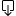
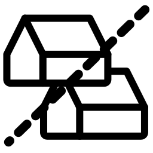
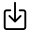
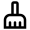
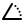
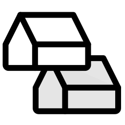

# Roof Commands

##  Export roofs

Export roofs to HBJSON. Use this file to edit the roofs in Pollination Rhino plugin. You can then use the import roofs to import the edited roofs back to Model Editor.

---

##  Find roof gaps

Identify gaps smaller than a specified gap distance.

Options

**Gap Distance**

  The maximum distance between two roofs that is considered an unwanted adjacency gap. Differences between roofs that are higher than this distance are considered meaningful separations between roofs that should be preserved. Typical recommended values might be around 15 cm or 6''.

---

##  Find roof intersection

Find the intersection between two or more roof geometries in 3D space and draw a line (or polyline) in the scene where this intersection exists. Intersection lines will only be drawn on the first roof geometry of the selection and no result will be returned when the intersection of roof planes lies outside the boundary of the first face of the selection. So it may be necessary to adjust the order of the selection if the desired result is not obtained.

---

##  Import roofs

Import roofs from a HBJSON file. Import roofs translates all the orphaned shades in the HBJSON file to roof elements.

Options

**Replace Current Roofs**

  Select to have all of the roofs currently within the model replaced by the new roof geometries in the imported HBJSON file. If deselected, the roofs will simply be added to the current roof geometries in the model.

---

##  Preview roofs

Show the selected roofs in 3D. The 3D preview shows up in a new floating window.

---

##  Resolve roof overlaps

Clean up roof geometries across the model.

---

##  Roof to shade

Convert roofs to shade objects.

---

##  Show tilt

Show tilt of the roof temporarily.

---

##  Subtract roofs

Subtract one roof part from another one. Use this command to clean up colliding roofs where faces overlap in plan and the user wants the taller of the two roof geometries in the overlap to be used.

---