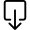
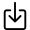
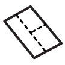
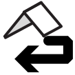
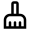
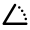

# Roof Commands

Below are all commands that operate on roofs.

##  Export roofs

Export roofs to HBJSON. Use this file to edit the roofs in Pollination Rhino plugin. You can then use the import roofs button to import the edited roofs back to Model Editor.

---

##  Find roof gaps

Identify gaps smaller than a specified gap distance.

---

##  Find roof intersection

Find the intersection between two or more roof geometries in 3D space and draw a line (or polyline) in the scene where this intersection exists. Intersection lines will only be drawn on the first roof geometry of the selection and no result will be returned when the intersection of roof planes lies outside the boundary of the first face of the selection. So it may be necessary to adjust the order of the selection if the desired result is not obtained.

---

##  Import roofs

Import roofs from a HBJSON file. All orphaned shades in the HBJSON file are translated to roof elements.

---

##  Merge roofs

Merge coplanar roofs together that are on the same story and touching edges.

---

##  Preview roofs

Show the selected roofs in 3D. The 3D preview shows up in a new floating window.

---

##  Reassign roofs

Reassign the model's roof geometries to the stories to which they are most applicable. This is useful after splitting roof geometries with story boundaries such that different roof elements are now applicable to different stories.

---

##  Remove duplicate roofs

Remove all duplicate roof geometries across the model.

---

##  Roof to shade

Convert roofs to shade objects.

---

##  Show tilt

Show tilt of the roof temporarily.

---

##  Subtract roofs

Subtract one roof part from another one.

---