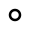

#  Find roof gaps

Identify gaps smaller than a specified gap distance.

## Options

* **Gap Distance**

  The maximum distance between two roofs that is considered an unwanted adjacency gap. Differences between roofs that are higher than this distance are considered meaningful separations between roofs that should be preserved. Typical recommended values might be around 15 cm or 6''.