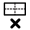

# Windows

Below are the commands that edit the room window geometry without changing floor geometry.

##  Export windows

Export windows and doors to HBJSON. Use this file to edit the geometry in Pollination Rhino plugin. You can then use the import windows button to import the edited windows back to Model Editor.

***

##  Import windows

Import windows and doors from a HBJSON file, replacing the currently-assigned windows. If rooms are selected while running this command, only the windows and doors of the selected rooms will be updated.

Options

**Projection Distance**

The distance used to project the window/door geometry onto parent rooms. Set to zero to have windows/doors only be added if they are coplanar with a room wall or roof.

**Angle Tolerance**

Angle tolerance in degrees, which sets the maximum angle difference between the normal vectors of the window and wall at which point the window will be projected onto the wall and assigned to it.

**Is Revit Sourced**

Select if the HBJSON file with windows has been exported directly from the Revit model. If so, the window geometry will be synchronized with the model's units and coordinate system if they have changed from the original Revit model.

***

##  Make windows flush

Make the edges of nearby windows flush with one another. Useful for cleaning up overlapping windows in a way that does not merge them together like 'Repair Windows' or removing gaps between windows without offsetting all edges like 'Offset windows for frame'.

Options

**Distance**

The maximin distance that the edges of nearby windows will be moved in order to make them flush with one another

**Ignore Skylights**

Select to have the skylights left as they are during the operation

**Ignore Windows**

Select to have the windows left as they are during the operation

***

## .svg>) Offset windows for frame

Offset the edges of all windows and/or skylights by a certain distance. Useful for translating between interfaces that expect the window frame to be included within or excluded from the geometry.

Options

**Offset Distance**

The distance to offset the edges all windows and/or skylights. Positive values will offset the windows outwards (adding frame). Negative will offset the windows inwards (removing frame)

**Overlap Resolve Method**

The method that should be used for resolving overlaps between windows if offsetting causes them to collide. 'Offset To Flush' will make window edges flush at the centerline between windows that are closer than 2 times the offset distance. 'Offset And Merge' will join windows together that overlap after offsetting. 'Make Flush Only' will only make close windows flush without performing any additional offset of the boundary around each flush group

**Ignore Skylights**

Select to have the skylights left as they are during the offset operation

**Ignore Windows**

Select to have the windows left as they are during the offset operation

***

##  Rectangularize windows

Convert windows and/or skylights to rectangles. Useful for cleaning Revit-exported window families that are supposed to be rectangular.

Options

**Max Area Change Percent**

A number for the maximum percent change in area that is allowed by the operation. For example, setting this to 100 will allow windows to double in size (instead of leaving them un-rectangularized). Set to a negative number to have all windows rectangularized no matter the change in area

**Ignore Skylights**

Select to have all skylights left as they are during the rectangularize operation

**Ignore Windows**

Select to have all windows left as they are during the rectangularize operation

***

##  Remove small windows

Remove windows of the room that are smaller than a certain specified Area Threshold.

Options

**Area Threshold**

The area of a window below which it will be removed

**Ignore Skylights**

Select to have all skylights left as they are during the operation

**Ignore Windows**

Select to have all windows left as they are during the operation

***

## .svg>) Repair invalid windows

Fix invalid windows by merging overlapping windows together, trimming windows that extend past the parent face, and deleting self-intersecting windows

Options

**Parent Edge Offset**

A number for the distance from the parent face edges to which windows will be trimmed. Entering a non-zero number here can ensure that space is left on parent faces to account for window frames

**Rectangle**

Select to have overlapping window geometries resolved by replacing them with a boundary rectangle around the overlapped group instead of boolean unioning the overlapped geometries. Useful in cases where a dozen or more geometries overlap with one another such that the unioned result is not as clean or desirable as a bounding rectangle

***

## .svg>) Simplify windows

Simplify and reduce the number of windows and/or skylights while maintaining the overall exterior window/skylight area. Useful for improving simulation speed without significantly changing energy use results.

Options

**Merge Distance**

The maximum distance between windows at which point they will be merged together into a single simpler window

**Single Window**

Select to have the windows simplified to a single window within the center of each wall, which matches the overall area of the original windows

**Delete Doors**

Select to have all doors removed from the rooms, which often have a small impact on overall building energy use

**Delete Interior**

Select to have the interior windows and doors removed from the rooms, which often have a negligible impact on overall building energy use

**Ignore Skylights**

Select to have all skylights left exactly as they are during the operation

**Ignore Windows**

Select to have all windows left exactly as they are during the operation

Note that this command is not intended to fix invalid or un-simulate-able windows and the "Repair windows" command should be used for these purposes.

***
