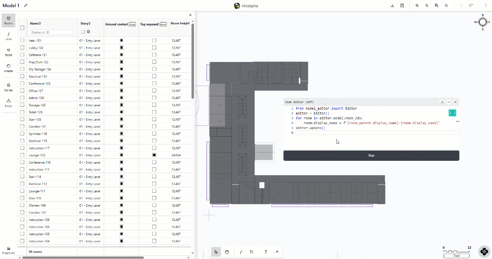

# Python Script Editor


The Python Script is currently an experimental feature.


Just like any other Pollination product, we are committed to empowering users to build their own solutions on top of our products. The Python script editor is nowhere close to what it should be but it is the starting point to provide an Application Programming Interface (API) for the Model Editor. It can already save you hours of work by allowing you to develop and run automated workflows to edit the Pollination Model.

<figure><figcaption></figcaption></figure>

## Opening the script editor

To open the script editor, click on the user setting button on the top right of the screen, and then select "show code editor".

<figure><figcaption></figcaption></figure>
